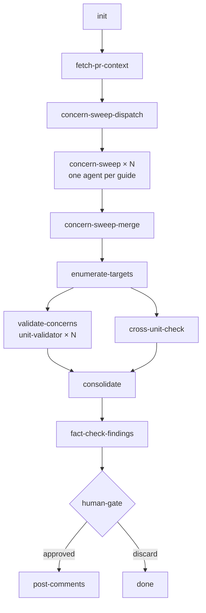

# Code Review Skill

Adversarial swarm PR review. Fetches the diff, filters a static concern library
against the actual changes, fans out per-guide concern sweepers in parallel,
consolidates and fact-checks findings, presents them for approval, then posts
inline GitHub comments.

## How to invoke

```python
# As a skill (PR auto-detected from current branch)
Skill(skill="workflow", args="--workflow workflows/code/code-review.yaml")

# Target a specific PR
Skill(skill="workflow", args="--workflow workflows/code/code-review.yaml --params pr_number=314")
```

```bash
# Or via slash command
/code-review
/code-review --pr 314
```

## Pipeline



## Concern library

Static checks live in `concerns/` — one file per domain. The **concern-sweep**
stage loads only the guides relevant to the diff, then filters each guide's
concerns to those triggered by the actual changes. Validators only spend time
on relevant checks.

| Guide | Loaded when |
|-------|-------------|
| `correctness.md` | diff contains `.py` files |
| `security.md` | diff contains `.py` files |
| `tests.md` | diff contains `.py` files (test files, or source files with `sys.exit()` / HTTP clients) |
| `patterns.md` | any diff (all file types) |
| `reuse.md` | diff contains `.py` files |
| `complexity.md` | diff contains `.py` files |
| `workflow.md`, `workflow-stages.md`, `workflow-fanout.md`, `workflow-fragments.md` | diff contains `.yaml`/`.yml` or `SKILL.md` files |
| `docs.md` | diff contains `.md`, `README`, or `SKILL.md` files |
| `resume-copy.md` | diff contains `src/resume/config/profiles/**`, `src/resume/config/*.yaml`, `src/resume/examples/*`, or any `linkedin*.yaml` |
| `phone-layout.md` | diff contains iOS layout files (`out/ios.iconlayout.json`, icon map) |

## Output

Approved findings are posted as inline GitHub PR comments and appended to:

```
~/.cache/claude/code-review-findings.ndjson
```

Fields: `ts`, `pr_number`, `repo`, `total`, `critical`, `major`, `minor`,
`posted`, `findings[]`, `worktree`.

```bash
# Findings by PR
jq -r '[.pr_number, .total, .critical, .major, .minor] | @tsv' \
  ~/.cache/claude/code-review-findings.ndjson | column -t
```

## Adding a new concern

1. Choose the right guide file based on what triggers the check.
2. Add an entry following the existing schema (`severity`, `check`, `triggers`, `example`).
3. The concern-sweep stage picks it up automatically — no code changes needed.
