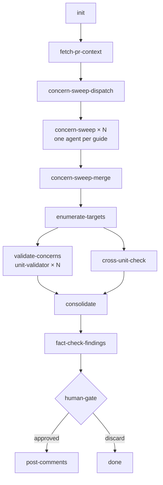

# Code Review

Runs an adversarial swarm review on a PR: fetch context, filter relevant
concerns, fan out per-file validators in parallel, consolidate and fact-check
findings, present for approval, then post inline GitHub comments.

## When to Use

- User says "review PR", "code review", or "review my changes"
- Before merge when a second set of eyes is needed on correctness, security, or patterns
- After implementing a domain or feature that hasn't had human review yet

## How to Run

**IMPORTANT**: Use the `/workflow` skill — do NOT call `./bin/workflow run --execute` directly. It only writes dispatch files and exits (status=pending). The `/workflow` skill is what actually spawns agents, waits for results, and handles human gates.

```python
Skill(skill="workflow", args="--workflow workflows/code/code-review.yaml --params pr_number=314")
```

Or invoke directly as a skill — the orchestrator resolves the PR number from
the current branch if `pr_number` is omitted.

## Workflow Params

| Param | Default | Description |
|-------|---------|-------------|
| `pr_number` | `""` | PR number to review (required; auto-detected from branch if blank) |

## DAG Overview

```
G0:  init                     (inline)
G1:  fetch-pr-context         (researcher)
G2:  concern-sweep-dispatch   (inline)
G3:  concern-sweep × N        (haiku-reviewer, parallel — one per guide)
     review-consolidated      (inline, parallel with concern-sweep)
G4:  concern-sweep-merge      (inline)
G5:  enumerate-targets        (researcher)
G6:  validate-concerns × N    (unit-validator, parallel)
     cross-unit-check         (cross-unit-validator, parallel with validate-concerns)
G7:  consolidate              (doc-writer)
G8:  fact-check-findings      (fact-checker)
G9:  human-gate               (propose, human_gate: true)
G10: post-comments            (code-writer)
```



## Review Guides

The static concern library lives at `concerns/` —
one file per domain. The concern-sweep stage (G2) reads only the guides
relevant to the diff, then filters each guide's concerns to those triggered
by the actual changes, so validators only spend time on relevant checks.

| Guide | Loaded when |
|-------|-------------|
| `concerns/correctness.md` | diff contains `.py` files |
| `concerns/security.md` | diff contains `.py` files |
| `concerns/tests.md` | diff contains `.py` files (test files, or source files introducing `sys.exit()` / HTTP clients) |
| `concerns/patterns.md` | any diff (all file types) |
| `concerns/reuse.md` | diff contains `.py` files |
| `concerns/complexity.md` | diff contains `.py` files |
| `concerns/workflow.md`, `concerns/workflow-stages.md`, `concerns/workflow-fanout.md`, `concerns/workflow-fragments.md` | diff contains `.yaml`/`.yml` or `SKILL.md` files |
| `concerns/docs.md` | diff contains `.md`, `README`, or `SKILL.md` files |

## CLI Quick Reference

| Need | CLI |
|------|-----|
| PR metadata | `gh pr-view -- --pr N --format json` |
| PR diff | `git diff main...HEAD` |
| File diff | `git diff main...HEAD -- path/to/file` |
| Changed files | `git diff main...HEAD --name-only` |
| Post inline comment | `gh pr-review-comment -- --path src/foo.py --line 42 --body "..."` |
| Review threads | `gh review-threads -- N` |
| Global findings log | `tail -20 ~/.cache/claude/code-review-findings.ndjson \| python3 -m json.tool` |

Never use raw `gh`, `curl`, or `git` as first choice — use `gh` for all PR operations
including posting inline review comments.

## Global Findings Log

Each completed review appends one NDJSON record to
`~/.cache/claude/code-review-findings.ndjson`. Fields: `ts`, `pr_number`,
`repo`, `total`, `critical`, `major`, `minor`, `posted`, `findings[]`,
`worktree`. Query with:

```bash
# tail recent reviews
tail -5 ~/.cache/claude/code-review-findings.ndjson | python3 -m json.tool

# count findings by PR
jq -r '[.pr_number, .total, .critical, .major, .minor] | @tsv' \
  ~/.cache/claude/code-review-findings.ndjson | column -t
```
