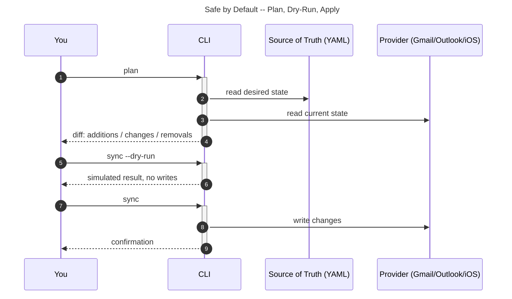

# Getting Started with Dancing Bear

> *You don't need to outrun the bear. You just need to outrun everyone else.*

This guide gets you from zero to productive in 10 minutes.

## What Is This?

Dancing Bear is a collection of command-line tools for personal workflow automation.
Built with [Claude Code](https://claude.ai/claude-code).

Core tools:
- Resume building — extract LinkedIn data, align with job postings, render tailored DOCX resumes
- Email management — sync Gmail/Outlook filters and labels from a single YAML file
- iOS phone layouts — export, plan, and apply home screen configurations

Also available: calendar scheduling, WhatsApp search, precious metals tracking, WiFi diagnostics.

Every command that modifies data has a `--dry-run` or `plan` step first.

## Prerequisites

- Python 3.11+
- Git
- A terminal
- Claude Code (optional) — see [Claude Code Setup](#claude-code-setup)

## Step 1: Clone and Set Up

```bash
git clone https://github.com/dancing-bear-show/dancing-bear.git
cd dancing-bear
make venv
./bin/assistant --help
```

## Step 2: Pick Your First Task

### Option A: Resume Building

Extract data from LinkedIn, align with job postings, and render tailored resumes:

```bash
# Extract from LinkedIn HTML export (save your profile page as HTML)
./bin/assistant resume extract --linkedin profile.html --out candidate.yaml

# Align with a job posting to find keyword matches
./bin/assistant resume align --data candidate.yaml --job job.yaml --out alignment.json

# Render to DOCX with a template
./bin/assistant resume render --data candidate.yaml --template template.yaml --out resume.docx

# Or render a tailored version filtered by alignment
./bin/assistant resume render --data candidate.yaml --template template.yaml \
  --filter-skills-alignment alignment.json --out tailored_resume.docx
```

### Option B: Email Filter Management (Gmail)

```bash
# Set up Gmail credentials (one-time)
./bin/mail-assistant-auth

# Export current filters to YAML
./bin/mail filters export --out my_filters.yaml

# Preview changes after editing my_filters.yaml
./bin/mail filters plan --config my_filters.yaml

# Dry-run, then apply
./bin/mail filters sync --config my_filters.yaml --dry-run
./bin/mail filters sync --config my_filters.yaml
```

### Option C: iOS Phone Layouts

One-shot reorganization (chains export-device → merge-folders → profile build → copy to device):

```bash
./bin/phone reorg
```

After it runs, tap Install in Settings → General → VPN & Device Management.
Code 625 from cfgutil is expected — the profile was copied successfully.

Set your device in `~/.config/credentials.ini` under `[ios_devices]`; then `reorg` needs no device flag.

```ini
[ios_devices]
default = bcsphone
bcsphone = 00008150-000578D421D8401C
ipadbiggest = 00008132-001645323C05001C
```

Flags:
- `--dry-run` — plan only; no build/install
- `--no-install` — build the profile but skip the device copy
- `--keep "com.example.app1,com.example.app2"` — pin apps on page 1
- `--device-label <label>` — target a non-default device
- `--udid <UDID>` — explicit UDID, wins over all other resolution

`merge-folders` redistributes a catch-all "Other" dump folder and loose apps into
existing folders (conservation invariant: no app is lost, added, or duplicated). It is
distinct from `auto-folders` (which builds flat coarse buckets from scratch).

Step-by-step:

```bash
./bin/phone export-device --out ios_layout.yaml
./bin/phone merge-folders --layout ios_layout.yaml --plan ios_plan.yaml
./bin/phone profile build --plan ios_plan.yaml --layout ios_layout.yaml --out layout.mobileconfig
```

### Option D: Other Tools (Experimental/POC)

```bash
# Calendar: bulk-create events from spreadsheet
./bin/schedule plan --source classes.csv --out schedule.yaml
./bin/schedule apply --plan schedule.yaml --calendar "My Calendar" --apply

# WhatsApp: search local chat database (macOS only)
./bin/whatsapp search --contains "meeting" --limit 20

# Metals: track precious metals from email receipts (proof of concept)
./bin/metals extract gmail --out metals.yaml
```

## Claude Code Setup

Claude Code is Anthropic's command-line coding assistant. This project was built with it
and includes project-specific configuration in `CLAUDE.md`.

### Installing Claude Code

```bash
# npm (recommended)
npm install -g @anthropic-ai/claude-code
claude --version
```

Or visit [claude.ai/claude-code](https://claude.ai/claude-code) for other installation options.

### First-Time Setup

```bash
# Set your API key
export ANTHROPIC_API_KEY=sk-ant-your-key-here
claude --help
```

### Using Claude Code with This Project

```bash
cd dancing-bear
claude
```

Claude Code reads `CLAUDE.md` automatically and understands the codebase structure.
It can run commands like `./bin/mail --help`, read and write files, and maintain
context across a session.

Example prompts:
```
"What does this project do?"
"Help me set up Gmail authentication"
"Create a filter that archives newsletters from example.com"
"The calendar sync isn't working — help me debug"
```

### Alternative: Other LLMs

If you prefer ChatGPT, Gemini, or another LLM:

```bash
# Get context to paste into your LLM conversation
cat .llm/CONTEXT.md | pbcopy  # macOS - copies to clipboard

# Or get a compact summary
./bin/llm agentic --stdout
```

Paste the context at the start of your conversation, then ask your questions.

## Core Concepts

### 1. Plan Before Apply

Every command that modifies data has a safe preview mode:

```bash
./bin/mail labels plan --config labels.yaml          # preview diff
./bin/mail labels sync --config labels.yaml --dry-run # simulate, no writes
./bin/mail labels sync --config labels.yaml           # apply
```



### 2. YAML as Source of Truth

Configuration lives in YAML files. The tools read these and sync state:

```yaml
# Example: filters.yaml
filters:
  - name: Archive Newsletters
    match:
      from: newsletter@example.com
    actions:
      - archive
      - label: Newsletters
```

### 3. Profiles for Multiple Accounts

Credentials in `~/.config/credentials.ini`:

```ini
[mail.personal]
credentials = ~/.config/google_creds_personal.json
token = ~/.config/token_personal.json

[mail.work]
credentials = ~/.config/google_creds_work.json
token = ~/.config/token_work.json
```

Then use `--profile`:

```bash
./bin/mail --profile personal labels list
./bin/mail --profile work labels list
```

## Common Commands Cheat Sheet

| Task | Command |
|------|---------|
| Resume — extract from LinkedIn | `./bin/assistant resume extract --linkedin profile.html --out candidate.yaml` |
| Resume — align with job posting | `./bin/assistant resume align --data candidate.yaml --job job.yaml` |
| Resume — render to DOCX | `./bin/assistant resume render --data candidate.yaml --out resume.docx` |
| Email — list Gmail labels | `./bin/mail labels list` |
| Email — export Gmail filters | `./bin/mail filters export --out filters.yaml` |
| Email — sync filters | `./bin/mail filters sync --config filters.yaml --dry-run` |
| iOS — reorganize home screen | `./bin/phone reorg` |
| iOS — export device layout | `./bin/phone export-device --out layout.yaml` |
| iOS — build layout profile | `./bin/phone profile build --plan plan.yaml --layout layout.yaml --out layout.mobileconfig` |
| WhatsApp search | `./bin/whatsapp search --contains "meeting"` |
| WiFi diagnostics | `./bin/wifi diagnose` |

## Troubleshooting

### "Command not found"

Activate the virtual environment:
```bash
source .venv/bin/activate
```

### Authentication errors

Re-run the auth helper:
```bash
./bin/mail-assistant-auth
```

### "No module named X"

Reinstall dependencies:
```bash
make venv
```

### Still stuck?

See `README.md` for the full command reference, or paste `.llm/CONTEXT.md` into your LLM of choice.

## Next Steps

1. `README.md` — full command reference
2. `config/` — example YAML configurations
3. `./bin/llm flows --list` — available automation flows
