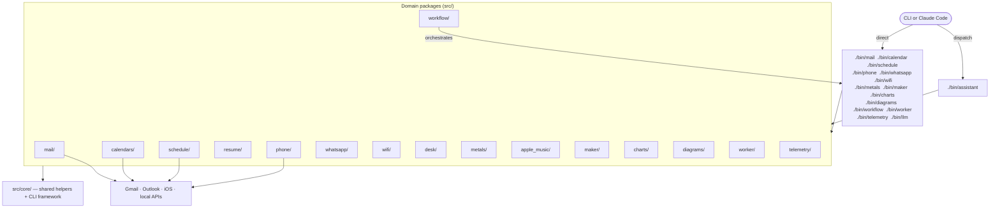
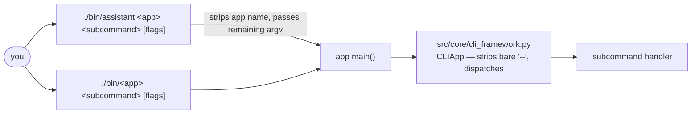
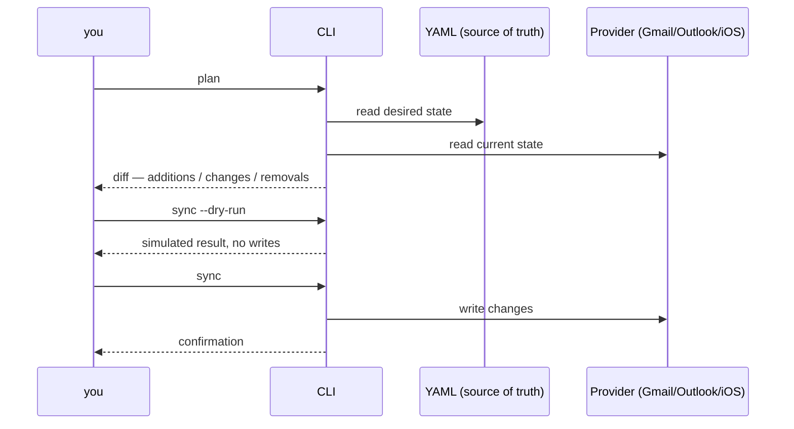
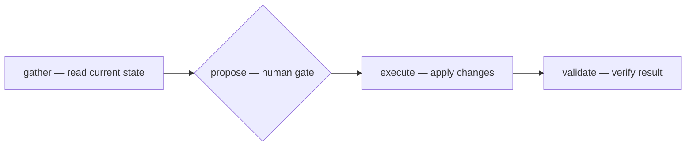

# Personal Assistants

> *You don't need to outrun the bear. You just need to outrun everyone else.*

[](https://github.com/dancing-bear-show/dancing-bear/actions/workflows/ci.yml)
[](LICENSE)
[](https://www.python.org/downloads/)
[](https://qlty.sh)

New here? [Getting Started Guide](GETTING_STARTED.md) — zero to productive in 10 minutes.

---

Unified, dependency-light CLIs for personal workflows across mail, calendars, schedules,
phone layouts, resumes, and WhatsApp. Built to be safe by default (plan and dry-run first),
with a single YAML source of truth for Gmail and Outlook filters.

Self-contained: all helpers and utilities are repo-internal. External dependencies are
minimal and lazily imported. This ensures public CLI backwards compatibility and reduces
fragility from external package changes. Internal APIs can be refactored freely — update
all call sites atomically without backwards-compatible wrappers.

Built with [Claude Code](https://claude.ai/claude-code). See [Claude Code Setup](GETTING_STARTED.md#claude-code-setup).

## Quick Start

```bash
git clone https://github.com/dancing-bear-show/dancing-bear.git
cd dancing-bear
make venv
./bin/assistant --help
```

CLI help:
- `./bin/assistant <apple-music|calendar|mail|maker|metals|music|phone|resume|schedule|whatsapp|wifi> --help`
- `./bin/mail --help`
- `./bin/calendar --help`
- `./bin/schedule --help`

## Core CLIs

| CLI | Entry point | Description |
|-----|-------------|-------------|
| Mail | `./bin/mail` | Gmail and Outlook — filters, labels, messages, forwarding, signatures |
| Calendar | `./bin/calendar` | Outlook calendar + Gmail scans |
| Schedule | `./bin/schedule` | Plan and apply calendar events from YAML/CSV |
| Resume | `./bin/assistant resume` | Extract, align, and render resumes |
| Phone | `./bin/phone` | iOS home screen layout tooling |
| WhatsApp | `./bin/whatsapp` | Local-only ChatStorage search |
| WiFi | `./bin/wifi` | Diagnostics |
| Metals | `./bin/metals` | Precious metals portfolio tracking |
| Apple Music | `./bin/apple-music-assistant` | Playlist management |
| Desk | `python3 -m desk` | macOS filesystem tidying (no `bin/desk`) |
| Maker | `./bin/maker` | Utility generators |
| Charts | `./bin/charts` | Render time-series charts from JSON |
| Diagrams | `./bin/diagrams` | Mermaid diagram generation |
| Workflow | `./bin/workflow` | YAML DAG workflow engine |

Legacy `-assistant` suffixed binaries still work (e.g., `./bin/mail-assistant`).

## Architecture

17 `src/` packages share a common `core/` framework and follow the same plan → dry-run → apply
safety pattern before touching any real provider.



`./bin/assistant <app>` and the standalone `bin/*` wrappers are two independent entry
points that both import the same domain module directly — `assistant` does not route
through the wrappers.

### Dispatch model



### Safety pattern

Every command that modifies data has a safe preview mode before any writes occur.



## Workflows

`src/workflow/` is a YAML DAG engine for multi-step agent runs with optional
human-approval gates. Definitions live under `workflows/`.



```bash
./bin/workflow list                           # available workflow definitions
./bin/workflow lint <workflow.yaml>           # validate structure without running
./bin/workflow validate-fragment <frag.yaml>  # validate a shared fragment
./bin/workflow run <workflow.yaml>            # parse + compile + show plan
./bin/workflow run <workflow.yaml> --execute  # execute
./bin/workflow status <workspace_dir>         # check run status
```

Shared fragments under `workflows/shared/` use a top-level `fragment: true` key and are
included via `include:` with a `prefix:`. Validate them with `validate-fragment`, not `lint`.

### Workflow authoring skills

| Skill | Use for |
|-------|---------|
| `/select-workflow` | Pick the right existing workflow for a task |
| `/write-workflow` | Author a new workflow YAML from a plain-language description |
| `/validate-workflow` | Lint workflow YAMLs, check skill docs for param/stage drift |
| `/split-workflow-stages` | Split oversized stages into single-responsibility stages |

## Credentials and Profiles

Prefer profiles in `~/.config/credentials.ini`; avoid passing tokens on the CLI.

```ini
[mail.gmail_personal]
credentials = /Users/you/.config/google_credentials.gmail_personal.json
token = /Users/you/.config/token.gmail_personal.json

[mail.outlook_personal]
outlook_client_id = <YOUR_APP_ID>
tenant = consumers
outlook_token = /Users/you/.config/outlook_token.json
```

Credentials path: `~/.config/credentials.ini` (or `$CREDENTIALS` env var, or `$XDG_CONFIG_HOME/credentials.ini`).

One-shot auth helper: `./bin/mail-assistant-auth`

## Mail (Gmail and Outlook)

Labels:
```bash
./bin/mail labels export --out labels.yaml
./bin/mail labels plan --config labels.yaml [--delete-missing]
./bin/mail labels sync --config labels.yaml --dry-run
```

Filters:
```bash
./bin/mail filters export --out filters.yaml
./bin/mail filters plan --config filters.yaml [--delete-missing]
./bin/mail filters sync --config filters.yaml --dry-run
```

Unified filters (single YAML → Gmail + Outlook):
```bash
python3 -m mail workflows from-unified --config config/filters_unified.yaml [--delete-missing] [--apply]
# --providers gmail,outlook to control providers
# --no-outlook-move-to-folders to disable Outlook folder moves
```

Outlook auth (device code):
```bash
./bin/mail --profile outlook_personal outlook auth device-code
./bin/mail --profile outlook_personal outlook auth poll --flow ~/.config/msal_flow.json --token ~/.config/outlook_token.json
./bin/mail --profile outlook_personal outlook auth ensure   # silent if cached
```

Other mail commands:
```bash
./bin/mail messages search --query "from:example@gmail.com"
# Structured search flags are Gmail only; an Outlook profile rejects them.
./bin/mail messages search --from example@gmail.com --subject-contains invoice --unread
./bin/mail messages get --ids MSG1,MSG2 --format json
./bin/mail messages threads-get --thread-id THREAD1 --include-body
./bin/mail auto propose && ./bin/mail auto apply
./bin/mail forwarding list && ./bin/mail forwarding add
./bin/mail signatures export && ./bin/mail signatures sync
./bin/mail backup --out backups/
```

## Calendar (Outlook)

```bash
./bin/calendar --profile outlook_personal outlook verify-from-config --config out/plan.yaml
./bin/calendar --profile outlook_personal outlook add-from-config --config out/plan.yaml
./bin/calendar --profile outlook_personal outlook update-locations --config out/plan.yaml --calendar "Your Family"
./bin/calendar --profile outlook_personal outlook remove-from-config --config out/plan.yaml --calendar "Your Family" --apply
./bin/calendar --profile outlook_personal outlook dedup --calendar "Your Family" --from 2025-01-01 --to 2026-12-31 --prefer-delete-nonstandard --keep-newest --apply
```

## Schedule

```bash
./bin/schedule plan --source schedules/classes.csv --out out/schedule.plan.yaml
./bin/schedule apply --plan out/schedule.plan.yaml --dry-run
./bin/schedule apply --plan out/schedule.plan.yaml --apply --calendar "Your Family"
./bin/schedule verify --plan out/schedule.plan.yaml --calendar "Your Family" --from 2025-10-01 --to 2025-12-31
./bin/schedule sync --plan out/schedule.plan.yaml --calendar "Your Family" --from 2025-10-01 --to 2025-12-31 --dry-run
```

## Resume

```bash
# 1. Extract unified data from LinkedIn HTML or existing resume
./bin/assistant resume extract --linkedin profile.html --out candidate.yaml
./bin/assistant resume extract --resume old_resume.docx --out candidate.yaml

# 2. Initialize a candidate skills file
./bin/assistant resume candidate-init --data candidate.yaml --out candidate_skills.yaml

# 3. Align with a job posting to find keyword matches
./bin/assistant resume align --data candidate.yaml --job job.yaml --out alignment.json

# 4. Render a DOCX resume
./bin/assistant resume render --data candidate.yaml --template template.yaml --out resume.docx

# Render tailored by alignment
./bin/assistant resume render --data candidate.yaml --template template.yaml \
  --filter-skills-alignment alignment.json --filter-exp-alignment alignment.json \
  --out tailored_resume.docx

# Infer structure from a reference DOCX
./bin/assistant resume structure --source reference.docx --out structure.yaml

# Generate heuristic summary
./bin/assistant resume summarize --data candidate.yaml --out summary.yaml
```

## iOS (Phone)

One-shot reorganization (chains export → merge-folders → profile build → copy to device):
```bash
./bin/phone reorg
```

Step-by-step:
```bash
./bin/phone export-device --out out/ios.IconState.yaml
./bin/phone plan --layout out/ios.IconState.yaml --out out/ios.plan.yaml
./bin/phone checklist --plan out/ios.plan.yaml --layout out/ios.IconState.yaml --out out/ios.checklist.txt
./bin/phone profile build --plan out/ios.plan.yaml --out out/ios.mobileconfig
```

Device config in `~/.config/credentials.ini`:
```ini
[ios_devices]
default = bcsphone
bcsphone = 00008150-000578D421D8401C
```

## WhatsApp (local-only)

```bash
./bin/whatsapp search --contains school --limit 20
./bin/whatsapp search --contact "Teacher" --since-days 30
```

## WiFi

```bash
./bin/wifi diagnose
```

## Desk (macOS)

```bash
python3 -m desk scan --paths ~/Downloads --out scan.yaml
python3 -m desk plan --config rules.yaml --out plan.yaml
python3 -m desk apply --plan plan.yaml --dry-run
python3 -m desk rules list
```

## Metals

```bash
./bin/metals extract gmail --profile gmail_personal --out metals.yaml
./bin/metals extract outlook --profile outlook_personal --out metals.yaml
./bin/metals costs --data metals.yaml
./bin/metals spot fetch
./bin/metals premium --data metals.yaml
./bin/metals build --data metals.yaml --out summaries/
./bin/metals excel merge --data metals.yaml --workbook portfolio.xlsx
```

## Apple Music

```bash
./bin/apple-music-assistant ping
./bin/apple-music-assistant list
./bin/apple-music-assistant export --out playlists.yaml
./bin/apple-music-assistant create --preset workout
./bin/apple-music-assistant dedupe --dry-run
```

## LLM Utilities

Context and navigation:
```bash
./bin/llm domain-map --stdout
./bin/llm inventory --stdout
./bin/llm familiar --stdout          # compact capsule
./bin/llm familiar --verbose         # verbose capsule
./bin/llm agentic --stdout
```

Flows:
```bash
./bin/llm flows --list
./bin/llm flows --id <flow_id> --format md
./bin/llm flows --tags mail,gmail
```

Code health:
```bash
./bin/llm stale --with-status --limit 10
./bin/llm deps --by combined --order desc --limit 10
./bin/llm check --fail-on-stale
```

Derive capsules:
```bash
./bin/llm derive-all --out-dir .llm
./bin/llm --app <app> derive-all --out-dir .llm --include-generated
```

## Directory Layout

```
bin/          CLI wrappers and entry points (see bin/_wrappers.yaml)
config/       canonical YAML inputs (source of truth)
out/          derived outputs and plans
.llm/         agent context, flows, capsules
workflows/    YAML workflow definitions
tests/        unittest suite
src/
  mail/         Gmail/Outlook providers, filters, labels, signatures
  calendars/    Outlook calendar + Gmail scans
  schedule/     plan/apply calendar schedules
  resume/       extract/summarize/render resumes
  phone/        iOS layout tooling
  whatsapp/     local-only ChatStorage search
  wifi/         diagnostics
  desk/         macOS filesystem tidying
  metals/       precious metals tracking
  apple_music/  Apple Music API
  maker/        utility generators
  charts/       time-series chart rendering (line/bar/area/dual)
  diagrams/     Mermaid diagram generation
  workflow/     YAML DAG engine (parse/compile/run/lint/list/status)
  worker/       background job queue and daemon
  telemetry/    Claude Code session telemetry (cost, tokens, TUI)
  core/         shared helpers and CLI framework
```

## Code Quality and Testing

Linting:
```bash
~/.qlty/bin/qlty check path/to/file.py    # check a file
~/.qlty/bin/qlty check src/mail/          # check a module
~/.qlty/bin/qlty check --fix path/to/file.py
```

Testing:
```bash
make test                                                              # preferred
make cov                                                               # with coverage
PYTHONPATH="$PWD/src" python3 -m unittest discover -s tests           # direct equivalent
```

Do not run bare `python3 -m unittest` in a worktree — an inherited `PYTHONPATH` silently
resolves imports to the main checkout and produces false greens. `make check-env` verifies
the environment before running tests.

Security suppressions:
```python
except Exception:  # nosec B110 - non-fatal cache write
except Exception:  # nosec B112 - skip malformed entries
```

Cleaning:
```bash
make clean       # remove build artifacts
make distclean   # deep clean including .venv
```

## Specialty Binaries

iOS device tooling:
- `bin/ios-install-profile` — install .mobileconfig profiles
- `bin/ios-setup-device` — initial device setup
- `bin/ios-use-device` — switch active device
- `bin/ios-verify-layout` — verify layout against plan
- `bin/ios-pages-sync` — sync pages layout
- `bin/ios-iconmap-refresh` — refresh icon map from device
- `bin/ios-hotlabel` — hot-label app icons
- `bin/ios-identity-verify` — verify signing identity
- `bin/ios-p12-to-der` — convert P12 to DER format

## Security

- Never commit credentials or tokens.
- Store secrets under `~/.config/` (file permissions 600).
- See [SECURITY.md](SECURITY.md) for known vulnerabilities and mitigation notes.
