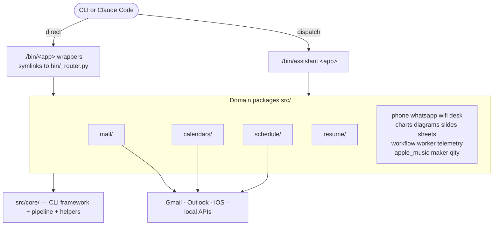
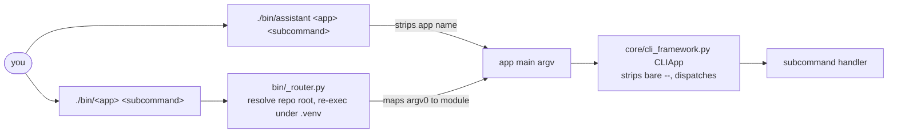
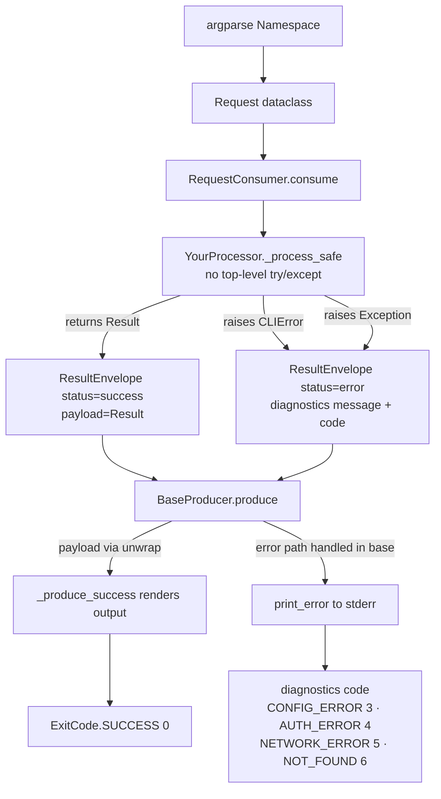
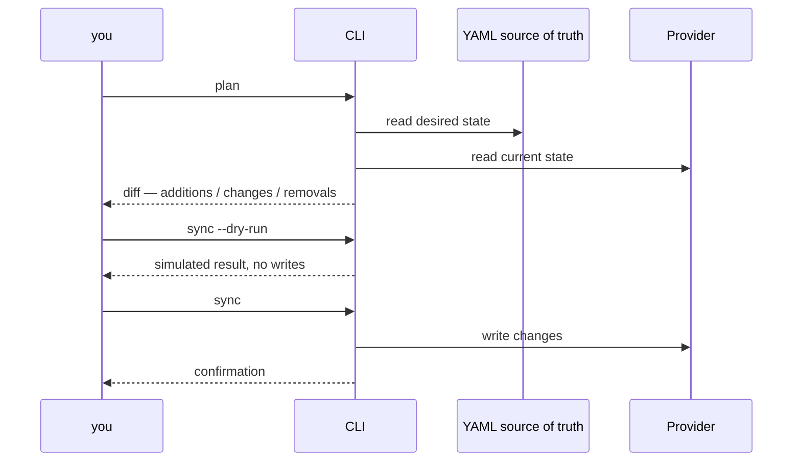

# Architecture

How this repo is put together, for someone about to change it. For setup and
first commands, see the README's **Quick Start** and **Commands** sections.

The short version: 19 packages under `src/` share one `core/` framework, and
every command that touches real data goes through **plan → dry-run → apply**.

## 1. The 10,000-foot view

`src/` holds all Python source (installable via `package-dir=src`). One package
per domain, plus `core/` underneath them all.

| Package | What it does |
|---|---|
| `mail/` | Gmail/Outlook labels, filters, sweep, forwarding, signatures |
| `calendars/` | Outlook calendar CLI + Gmail scans |
| `schedule/` | plan/apply calendar schedules |
| `resume/` | extract / summarize / render resumes |
| `phone/` | iOS layout tooling |
| `whatsapp/` | local-only ChatStorage search |
| `desk/` | desktop / workspace tooling |
| `maker/` | utility generators |
| `charts/` | time-series charts from JSON |
| `diagrams/` | Mermaid generation (shells out to `mmdc`) |
| `slides/` | PowerPoint decks from YAML |
| `sheets/` | styled `.xlsx` from YAML |
| `workflow/` | YAML DAG workflow engine |
| `telemetry/` | Claude Code session cost/token telemetry |
| `worker/` | background job queue and daemon |
| `apple_music/`, `wifi/`, `qlty/` | Apple Music, Wi-Fi, qlty scan/triage |
| `core/` | shared framework — everything below |



**Design rule that explains most of the layout:** the repo is self-contained and
dependency-light. Helpers live in `core/`, not in external packages. Optional
heavy deps (Google APIs, PyYAML, textual) are lazily imported at point of use.
The public CLI surface (`bin/*`) is backwards-compatible and load-bearing.
Internal APIs are not: refactor them freely and update all call sites atomically,
without compatibility wrappers.

## 2. Two entry points

Two independent ways in, and both import the same domain module directly.
**`assistant` does not route through the wrappers.**

- `./bin/assistant <app> <subcommand>`: `core/assistant_cli.py` maps the app
  name to a module in `APP_MODULES` (`assistant_cli.py:14`), strips the app name,
  and calls that module's `main(argv)` with the remaining argv.
- `./bin/<app> <subcommand>`: the standalone wrapper.

Every `bin/*` wrapper is a **symlink to `bin/_router.py`**. The router:

1. resolves the repo root *through the symlink*: `Path(__file__).resolve()`
   follows it, so `_REPO_ROOT` is always the real repo (`_router.py:35`);
2. re-execs under that repo's `.venv/bin/python3` when one exists
   (`_router.py:36-51`), guarded by a sentinel so it cannot loop;
3. inserts that repo's `src/` on `sys.path` (`_router.py:53-55`);
4. derives the target module from `sys.argv[0]` via the generated `_MODULE_MAP`.

`bin/_gen_wrappers.py` generates that map from `bin/_wrappers.yaml`. Run
`make bin-wrappers` after editing the YAML; don't hand-edit the router.

> **Gotcha worth learning early.** An inherited `PYTHONPATH` beats both the
> editable install and the router's own `sys.path` insert, so a wrapper run from
> your worktree can load *another checkout's* code and print pre-change behavior.
> Before concluding an edit didn't take effect, run
> `python3 -c "import resume; print(resume.__file__)"`. If that path isn't under
> the tree you're editing, the environment is wrong, not your change. The same
> root cause makes bare `python3 -m unittest` unsafe here; use `make test`.

## 3. The CLI framework

`src/core/cli_framework.py` provides `CLIApp`, the base every argparse CLI is
built on. Dispatch is **positional subcommands**, never flag-prefixed:

```bash
./bin/mail labels sync --dry-run          # subcommand, then flags
./bin/calendar outlook add --subject "…"
```

`CLIApp` strips a bare `--` separator from argv automatically
(`cli_framework.py:284`), so the separator is optional for all CLIApp-based CLIs.
The workflow engine still inserts one when compiling stages
(`src/workflow/compiler.py`); `llm` and `docs` are exempt via `_NO_SEPARATOR_CLIS`.

All 18 apps support `--agentic --agentic-format json`, which emits a
machine-readable schema derived from the real parser. It cannot drift from the
actual CLI. Run `./bin/llm inventory --stdout` for the authoritative invocation
per app; `./bin/<app>` is wrong for four of them.



## 4. The pipeline

`src/core/pipeline.py` defines the shape a command is meant to take:
**Consumer → SafeProcessor → BaseProducer**, carrying a `ResultEnvelope`.

- `ResultEnvelope[ResultT]` (`pipeline.py:32`) carries `status`, `payload`,
  `diagnostics`. `.ok()` tests success; `.unwrap()` returns the payload or raises
  `ValueError`. Use `.unwrap()`, never a bare `assert` — asserts strip under `-O`.
- `Consumer` / `Processor` / `Producer` are `Protocol`s (`pipeline.py:48-60`).
- `RequestConsumer[RequestT]` (`pipeline.py:63`) wraps any request object, so no
  domain needs its own store-and-return consumer class.
- `SafeProcessor[T, R]` (`pipeline.py:132`): you override `_process_safe`.
- `BaseProducer` (`pipeline.py:83`): you override `_produce_success`.
- `run_pipeline(request, processor_cls, producer_cls) -> int` (`pipeline.py:160`)
  wires the three together and returns the exit code.

**Why it's shaped this way.** `_process_safe` must contain **no top-level
`try/except`**; it just raises. `SafeProcessor.process` catches, then converts a
`CLIError` into an envelope carrying `str(e)` and `int(e.code)`, or any other
exception into an envelope with just a message (`pipeline.py:145-153`).
Symmetrically, `_produce_success` must **not branch on error state**.
`BaseProducer.produce` handles the failure path and only delegates on success
(`pipeline.py:104-111`). The payoff: error handling is written once, and no
command re-implements it. A typical handler is three lines:

```python
def run_outlook_xyz(args) -> int:
    request = XyzRequest(service=svc, ...)
    return run_pipeline(request, XyzProcessor, XyzProducer)
```



**This is the target pattern, not a universal one.** Adoption is uneven, and
that's expected. `.llm/DESIGN_CRITERIA.md` C2 defines an applicability test: the
pipeline applies to a command that makes a network call, touches state outside
the invocation, shells out, or has multiple distinct failure modes. A pure
in-memory transform gains nothing from the wrapper and should not be converted.

Files referencing `SafeProcessor`/`BaseProducer` per package, as of this writing:

| Adoption | Packages |
|---|---|
| Heavy | `mail/` (20), `calendars/` (19) |
| Partial | `schedule/`, `phone/`, `telemetry/`, `worker/` (2); `whatsapp/`, `desk/`, `maker/`, `diagrams/`, `workflow/`, `apple_music/`, `wifi/` (1) |
| None | `resume/`, `charts/`, `slides/`, `sheets/`, `qlty/` |

These are file counts, current as of this writing and certain to drift. Treat
the shape as the point, not the numbers. Re-measure before relying on them:

```bash
grep -rl "SafeProcessor\|BaseProducer" src/<package>/ | wc -l
```

Two documented deliberate exemptions: `charts/` is pure in-memory rendering with
no subprocess or network I/O (`src/charts/README.md:49`), and `workflow/` is
itself the pipeline orchestrator, so wrapping it would nest one engine inside
another (`src/workflow/dispatchers.py:137-140`).

> `DESIGN_CRITERIA.md` C2 records a "known gap" listing `telemetry/`,
> `worker/`, `apple_music/`, `charts/`, `diagrams/`, `workflow/` at *zero* usage.
> That snapshot is stale: all six now reference the pipeline. The genuine zeros
> are the four in the table above. Verify with a grep before trusting either list.

## 5. Error handling and exit codes

Domain errors subclass the `CLIError` dataclass hierarchy in
`src/core/cli_errors.py`: `ConfigError`, `AuthError`, `NetworkError`,
`NotFoundError`, `UsageError`. Don't raise bare `Exception`/`ValueError` at the
CLI boundary. Each subclass hard-codes its own exit code, so raising the right
type is what makes the right code surface.

| Name | Value | Meaning |
|---|---|---|
| `SUCCESS` | 0 | ok |
| `ERROR` | 1 | generic failure |
| `USAGE` | 2 | bad arguments / unknown app |
| `CONFIG_ERROR` | 3 | missing or invalid config |
| `AUTH_ERROR` | 4 | credentials / token failure |
| `NETWORK_ERROR` | 5 | network or API failure |
| `NOT_FOUND` | 6 | resource not found |
| `INTERRUPTED` | 130 | Ctrl+C |

`handle_error(error, verbose=False)` (`cli_errors.py:65`) is the boundary helper.
It prints `Error: …` plus an optional `Hint: …` to stderr and returns the mapped
code, turning `KeyboardInterrupt` into `130`. No ad hoc `sys.exit(1)` with an
unmapped code.

Bare `except Exception: pass/continue` requires a `# nosec B110/B112` comment
naming the intentional failure mode. qlty and bandit enforce this.

### No-subcommand exit codes (rule A7)

A bare invocation is not an error, so it is not covered by the table above.
16 of the 18 apps print full help to **stdout** and exit **0**, which is
`run_with_assistant`'s default.

Two differ deliberately, and both say so in the source: `worker` (1) and
`workflow` (2) print a one-line usage to **stderr** via `_no_command_usage()`,
preserving a legacy public interface. That written rationale is what separates a
deliberate code from drift — `charts` and `telemetry` also had non-zero codes
until neither could point to a reason, and were normalised.

`tests/cli_no_subcommand_contract.py` pins each app's code **and stream**; the
stream matters because help-on-stdout and usage-on-stderr are different
interfaces that an exit-code check alone cannot tell apart.

One inconsistency to know about: `CLIApp.run()` returns `ExitCode.USAGE` (2) for
a missing subcommand while `run_with_assistant()` returns 0. Every app uses the
latter, so the contract pins observed behaviour rather than reconciling the two.

## 6. Provider abstraction

Where a domain has interchangeable backends (Gmail/Outlook today), the CLI and
pipeline layers depend on the abstract interface — `BaseProvider` in
`src/mail/providers/base.py` — and never on a concrete provider class.

Capability differences are declared, not sniffed. `BaseProvider.capabilities()`
returns a `set[str]` (`base.py:130`, defaulting to empty); `GmailProvider`
returns `{"labels", "filters", "sweep", "forwarding", "signatures"}`
(`gmail.py:90`). Gate on membership rather than `isinstance()` branching on the
concrete type.

Where a capability is genuinely absent, the base class documents why the method
is not `@abstractmethod`: `get_thread` stays concrete and raises
`NotImplementedError`, because Outlook doesn't support threads and making it
abstract would break `OutlookProvider` instantiation (`base.py:124-128`).

A mixin composes on cross-cutting behavior (caching, auth refresh) rather than
duplicating it per provider (`CacheMixin`). This matches C4's preference for
composition over inheritance and its rule against inheriting more than two levels
deep without a documented reason.

> One caveat before you build on this: `capabilities()` currently has **no call
> sites** outside its own definition and the two provider overrides. Treat it as
> a declared contract that is not yet load-bearing. If you wire the first real
> gate, test membership (`"x" in provider.capabilities()`), never `.get("x")`,
> which raises `AttributeError` on a set.

## 7. The safety pattern

The invariant that makes it safe to point any of this at a real mailbox:
**plan → dry-run → apply.** Every command that modifies data has a preview mode
before any write occurs. C10 makes the verbs standard across domains:
`plan` → `sync`/`apply` → `verify`. Don't invent synonyms like `push` or `commit`.



A single YAML file is the source of truth for both Gmail and Outlook filters, so
the diff is computed against declared intent rather than accumulated drift.

## 8. Where generated output goes

Resolved by `src/core/paths.py`, in order:

1. an explicit `--out-dir` passed to the command
2. `$DANCING_BEAR_DATA_HOME`
3. `$XDG_DATA_HOME/dancing-bear`
4. `~/.local/share/dancing-bear` (default)

Each domain gets its own subdirectory via `output_dir("<domain>")`
(`paths.py:109`), such as `<data-home>/resume` and `<data-home>/charts`, so
domains can't collide. New output-producing code should call `output_dir()`
rather than defaulting to a relative path.

**Why output leaves the checkout.** A relative default resolves against the
working directory, so running a command from the repo wrote generated files
*into the checkout* — including resumes carrying a name, phone number, and email.
Those paths are gitignored, which prevents an accidental commit but not an
accidental deletion: `git clean -fdx` removes ignored files, and your only copy
goes with them. A relative `--out-dir` is still honored as-is, so
`--out-dir out` writes to `./out` for scripts depending on the old behavior.

User-written config resolves the same way against the config root
(`DANCING_BEAR_CONFIG_HOME`, `XDG_CONFIG_HOME/dancing-bear`,
`~/.config/dancing-bear`). Mail filter rules live there, not in the checkout: a
filter set enumerates who you receive mail from and where you forward it, which
does not belong in a public repository.

## Shared helpers — check here first

C7: before adding a helper to a domain package, check `src/core/`. Reimplementing
one of these is a duplication defect, not a style preference. Promote a helper
used by two or more domains here rather than copy-pasting it.

| Module | Purpose |
|---|---|
| `cli_framework.py` | `CLIApp`, subcommand dispatch |
| `cli_errors.py` | `ExitCode`, `CLIError` hierarchy |
| `cli_output.py` | `OutputWriter` / `OutputFormat` (TEXT/JSON/YAML/TABLE) |
| `pipeline.py` | Consumer / SafeProcessor / BaseProducer |
| `agentic_schema.py`, `agentic.py` | auto-derived `--agentic` schemas |
| `paths.py` | data/config root resolution |
| `http.py`, `retry.py`, `parallel.py` | network, backoff, concurrency |
| `secrets.py`, `auth.py`, `path_guard.py` | credential handling and masking |
| `yamlio.py`, `fileutil.py`, `textio.py` | I/O |
| `collections.py`, `text_utils.py`, `date_utils.py`, `format_utils.py` | pure transforms |
| `cache.py`, `process.py`, `gh_cli.py`, `preflight.py` | caching, subprocess, `gh`, checks |

Output goes through an injected `OutputWriter`. Not ad hoc `print()`, and not
`if fmt == "json": …` repeated per command (C6).

## Conventions you'll be graded against

`.llm/DESIGN_CRITERIA.md` holds C1–C10 as a pass/fail standard with file:line
citations, not aspirational prose. The ones that bite first:

- **C1**: request/result/config shapes crossing a boundary are `@dataclass`, not
  `dict`/`Namespace`/tuple. Immutable config uses `frozen=True`.
- **C8**: every processor needs a happy-path test *and* one sad-path test per
  distinct failure mode, asserting the correct `ExitCode`/`CLIError` subtype —
  not merely that some error was raised. Provider-backed commands test both
  providers using the existing fakes in `tests/*/fixtures.py`, never live calls.
- **C9**: reuse `tests/fixtures.py` before writing new ones.
- **C10**: `<Verb><Noun>Processor` / `Producer` / `Request` / `Result`. Deviating
  names make cross-domain grep and audit unreliable.

Explicit non-goals: renaming `bin/*` entry points or CLI flags, adding external
dependencies, and rewriting already-migrated pipelines without a found defect.

## Before you change anything

- **Check for an existing workflow first**: `./bin/workflow list`. There are 52.
  Improving one beats forking a near-duplicate.
- **Read the LLM context files** in order: `.llm/CONTEXT.md`, `.llm/PATTERNS.md`
  (copy-paste templates for everything above), then
  `./bin/llm domain-map --stdout` for where things live.
- **Lint what CI lints.** `make lint` runs ruff only; CI runs `qlty check`, which
  adds bandit and radarlint. Scope to your own changes with
  `git diff --name-only main...HEAD` — **three dots**, so you diff against the
  merge-base and not every commit merged into main since you branched.
- **Verify the test suite actually ran.** Exit code 0 is not evidence. Confirm the
  `Ran N tests` line, and merge stderr, because unittest writes it there:
  `make test > /tmp/t.log 2>&1; grep -E "^Ran [0-9]+ tests" /tmp/t.log`
