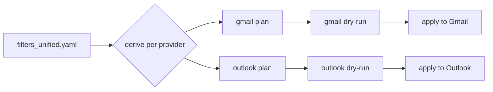
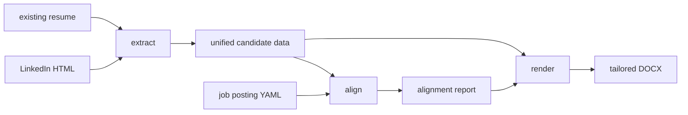

# What This Repo Can Do

A guided tour of the capabilities worth knowing about. For setup, see
`getting-started.md`. For the full command surface of any app, prefer the
auto-derived schema over `--help`:

```bash
./bin/mail --agentic --agentic-format yaml --agentic-compact
```

---

## 1. Nothing mutates without asking first

Every command that changes remote state makes you opt in to the mutation.
Planning is read-only and prints a diff; a rehearsal walks the real apply path
and reports what it would do without writing.

The opt-in differs by domain, so check the flag before the first real run. Mail
syncs mutate unless you pass `--dry-run`, while `schedule apply` and
`workflow run` rehearse unless you pass `--apply` or `--execute`. Either way you
can point these tools at a live mailbox or calendar and inspect the blast radius
first.

```bash
# Gmail filters: read-only diff, then rehearsal, then real
./bin/mail filters plan --config filters.yaml
./bin/mail filters sync --config filters.yaml --dry-run
./bin/mail filters sync --config filters.yaml

# Calendar schedules: apply is a dry-run until you pass --apply
./bin/schedule plan --source schedules/classes.csv --out schedule.plan.yaml
./bin/schedule apply --plan schedule.plan.yaml
./bin/schedule apply --plan schedule.plan.yaml --apply
```

Deletions are opt-in on top of that. `--delete-missing` is required before any
sync will remove a filter or label absent from your config, so a truncated YAML
file cannot quietly wipe your rules.

---

## 2. One YAML for Gmail and Outlook

Gmail filters and Outlook rules are different APIs with different data models.
This repo puts a single unified YAML in front of both. Edit one file, derive a
plan per provider, review each diff separately, then apply.



Start by exporting what already exists. You do not write the YAML from scratch:

```bash
./bin/mail filters export --out gmail_filters.yaml
./bin/mail outlook rules.export --out outlook_rules.yaml
```

Then drive both providers from the unified file. Without `--apply` this plans
only:

```bash
./bin/mail workflows from-unified --config filters_unified.yaml --out-dir out
./bin/mail workflows from-unified --config filters_unified.yaml --out-dir out --apply
```

Restrict to one provider with `--providers gmail` or `--providers outlook`.
The unified config defaults to `~/.config/dancing-bear/filters_unified.yaml`.

Per-provider commands remain available when you want to work one side at a
time. Note the Outlook subcommands are dotted (`rules.plan`, not `rules plan`):

```bash
./bin/mail outlook rules.plan --config filters_unified.yaml
./bin/mail outlook rules.sync --config filters_unified.yaml --dry-run
```

Labels and signatures work the same way: `./bin/mail labels export`,
`labels plan`, `labels sync --dry-run`.

---

## 3. Workflow engine

52 checked-in YAML DAG workflows covering PR review, coverage expansion,
complexity sweeps, CI debugging, and resume tailoring. Stages run in parallel
where the DAG allows, and human gates pause execution for approval before
anything consequential.

```bash
./bin/workflow list                       # authoritative live catalog
./bin/workflow run <file.yaml>            # dry-run by default
./bin/workflow run <file.yaml> --execute --params key=value
```

See `workflow-engine.md` for stage kinds, gates, and authoring.

---

## 4. Every CLI describes itself to agents

All 18 apps emit a machine-readable schema derived from the actual argparse
parser, so it cannot drift from the real CLI the way hand-written docs do.
Agents read the schema instead of guessing at flags.

```bash
./bin/llm inventory --stdout              # how to invoke each app
./bin/telemetry --agentic --agentic-format yaml --agentic-compact
```

Four invocations are non-obvious: `apple-music` and `qlty` use `-assistant`
wrappers, `resume` goes through `./bin/assistant resume`, and `desk` has no
wrapper (`python3 -m desk`).

See `why-clis-not-mcp.md` for the reasoning behind this over an MCP server.

---

## 5. Resume tailoring

Extract structured data once from a LinkedIn export or an existing resume,
score it against a specific job posting, then render a DOCX filtered down to
what that posting actually asks for. The alignment report is a real artifact
you can inspect: it tells you which keywords matched before you render.



```bash
# Extract accepts txt/md/html/docx/pdf from either source
./bin/assistant resume extract --linkedin profile.html --out candidate.yaml

# Score against a posting
./bin/assistant resume align --data candidate.yaml --job job.yaml --out alignment.json

# Render everything, or render tailored
./bin/assistant resume render --data candidate.yaml --template template.yaml --out resume.docx
./bin/assistant resume render --data candidate.yaml --template template.yaml \
  --filter-skills-alignment alignment.json \
  --filter-exp-alignment alignment.json \
  --out tailored_resume.docx
```

`align` can also write tailored data directly with `--tailored`, capped by
`--max-bullets` and `--min-exp-score`.

---

## 6. Telemetry on your own Claude Code usage

Reads local session transcripts and reports cost and token consumption by
agent or by day. Useful for finding which workflows are expensive.

```bash
./bin/telemetry cost --since 7d --group-by agent
./bin/telemetry sessions --since 7d
./bin/telemetry summary
```

Windows are `--since 7d` / `24h`, not a day count. This CLI is Click-based
rather than argparse, so its flag parsing differs slightly from the others.
`--format` takes `table|json|csv`.

There is a live TUI behind an optional extra:

```bash
pip install -e '.[tui]'
./bin/telemetry live
```

---

## 7. Charts and diagrams

Charts render time-series PNGs from a JSON contract. Diagrams generate Mermaid
from YAML specs, including pie charts built straight from telemetry data.

```bash
./bin/charts render --input spec.json --output chart.png
./bin/charts grid --config grid.yaml --output grid.png

./bin/diagrams from-yaml --input spec.yaml
./bin/diagrams validate --input diagram.mmd
./bin/diagrams telemetry cost-pie
```

Charts need matplotlib (`pip install matplotlib`). The diagram subcommands that
touch rendering — `render`, `validate`, `embed` — need the Mermaid CLI
(`npm install -g @mermaid-js/mermaid-cli`). `from-yaml` emits Mermaid text and
needs neither.

---

## 8. WhatsApp search that never leaves the machine

Queries the local `ChatStorage.sqlite` that the macOS WhatsApp app already
maintains. No API, no account linking, no network. macOS only.

```bash
./bin/whatsapp search --contains invoice --limit 20
./bin/whatsapp search --contact 'Teacher' --since-days 30 --json
```

`--contains` repeats; combine terms with `--any` (default) or `--all`, and
narrow direction with `--from-me` / `--from-them`.

---

## 9. iOS home screen layout

Export the layout off a device, plan a reorganization as YAML, and review a
checklist before touching anything. Analysis subcommands flag unused apps and
suggest folder groupings.

```bash
./bin/phone export-device --out ios.IconState.yaml
./bin/phone plan --layout ios.IconState.yaml --out ios.plan.yaml
./bin/phone analyze --layout ios.IconState.yaml --format text
./bin/phone checklist --plan ios.plan.yaml
```
