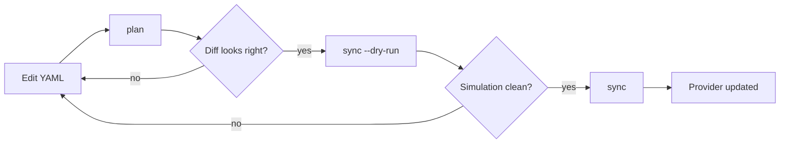
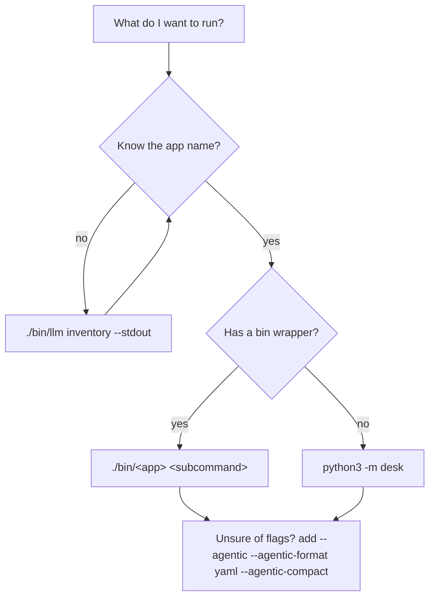

# Getting Started — A Guided Tour

This is the guided tour: a narrative path from a fresh clone to a first useful
result. For the reference version (cheat-sheet tables, per-tool option lists,
full setup steps) see [`../GETTING_STARTED.md`](../GETTING_STARTED.md).

## 1. What this is

Dancing Bear is a set of dependency-light command-line tools for personal
workflows: mail filters and labels, calendars and schedules, resumes, iOS home
screen layouts, WhatsApp search, and more. Each tool is a small CLI under
`bin/`, backed by a Python package under `src/`, with YAML as the source of
truth for anything it syncs. The tools serve LLM agents as much as people, so
every CLI can emit a machine-readable schema of itself. Nothing writes to a real
provider without showing you the change first.

## 2. Prerequisites and setup

Python 3.11, git, a terminal. Then:

```bash
git clone https://github.com/dancing-bear-show/dancing-bear.git
cd dancing-bear
make venv
```

Confirm the suite runs:

```bash
make test
```

Look for the `Ran N tests` line. A zero exit code alone is not proof the suite
executed.

Credentials come later, and only for the tools that talk to a provider. They
live in profiles in `~/.config/credentials.ini`, under sections like
`[mail.gmail_personal]` and `[mail.outlook_personal]`. Never pass a token as a
flag. The README documents the INI layout and the auth helper once: see
[Credentials and Profiles](../README.md#credentials-and-profiles).

## 3. Your first command

Nothing below needs credentials or network access.

```bash
./bin/llm familiar --stdout
```

That prints a read-only familiarization capsule: which paths to skip, which
context files to read, in what order. It is the fastest way to orient an LLM
agent, or yourself, before touching anything.

Two more worth running now:

```bash
./bin/workflow list        # 52 checked-in workflows
./bin/mail --agentic --agentic-format yaml --agentic-compact
```

The second is the discovery pattern used throughout this repo. Prefer it over
`--help`: the schema is derived from the real parser, so it cannot drift from
the CLI it describes.

## 4. The one habit that matters

Every mutating command previews before it writes: **plan → dry-run → apply**.



In practice, for mail labels:

```bash
./bin/mail labels plan --config labels.yaml            # show the diff
./bin/mail labels sync --config labels.yaml --dry-run  # simulate, no writes
./bin/mail labels sync --config labels.yaml            # apply
```

`plan` reads both your YAML and the provider's current state and reports the
difference. `--dry-run` walks the real sync path but stops short of writing.
Only the bare command mutates anything. The same three-step shape recurs across
mail, calendars, schedules, and phone layouts, so learning it in one domain
teaches you all of them.

## 5. Pick your first real task

[`features.md`](features.md) covers each of these in full. The one-liners here
are to help you choose.

- **Mail filters and labels** — keep Gmail and Outlook rules in one YAML file
  and sync both from it. Needs a mail profile. Run
  `./bin/mail filters export --out filters.yaml` first to capture what you
  already have, then edit and sync.
- **Resume** — extract structured data from a LinkedIn export, align it against
  a job posting, and render a tailored DOCX. Runs entirely on local files, so it
  is the best starting point before you set up credentials. Note the
  invocation: `./bin/assistant resume …`, not `./bin/resume`.
- **Phone layouts** — export your iPhone home screen, plan a reorganization, and
  build an installable configuration profile. Needs a connected device.

## 6. How to discover anything



Three commands cover most of it:

```bash
./bin/llm inventory --stdout    # authoritative: how to invoke all 18 apps
./bin/workflow list             # multi-step processes already captured as DAGs
./bin/<app> --agentic --agentic-format yaml --agentic-compact
```

`inventory` is authoritative because `./bin/<app>` is wrong for four apps:
`apple-music` and `qlty` use `-assistant` wrappers, `resume` goes through
`./bin/assistant resume`, and `desk` has no wrapper at all (`python3 -m desk`).

Check `./bin/workflow list` before building any multi-step process by hand.
There is a good chance one already exists.

## 7. Where output lands

Generated files are written **outside the checkout** by default, so a
`git clean -fdx` cannot destroy a rendered resume. The destination resolves in
this order:

1. an explicit `--out-dir` passed to the command
2. `$DANCING_BEAR_DATA_HOME`
3. `$XDG_DATA_HOME/dancing-bear`
4. `~/.local/share/dancing-bear` (the default)

Each domain gets its own subdirectory — `<data-home>/resume`,
`<data-home>/charts`, and so on. A relative `--out-dir` is honoured as given,
so `--out-dir out` still writes into `./out`.

## 8. Troubleshooting

**`command not found`** — use the `./bin/` wrappers rather than bare tool
names, and run them from the repo root. The wrappers resolve the interpreter
and import path for you.

**Authentication errors** — the profile is missing or incomplete. See
[Credentials and Profiles](../README.md#credentials-and-profiles), and the
troubleshooting section of [`../GETTING_STARTED.md`](../GETTING_STARTED.md) for
provider-specific cases.

**A change you made seems to have no effect** — before assuming the change is
wrong, print where the module actually loaded from:

```bash
python3 -c "import resume; print(resume.__file__)"
```

If that path is not under the tree you are editing, an inherited `PYTHONPATH`
is resolving the import to a different checkout, and your code never ran. Same
cause applies to tests: use `make test`, never a bare `python3 -m unittest`.

## 9. Where to go next

- [`features.md`](features.md) — what each tool does, with runnable examples
- [`architecture.md`](architecture.md) — how the packages and CLI layers fit together
- [`workflow-engine.md`](workflow-engine.md) — the YAML DAG engine behind `./bin/workflow`
- [`why-clis-not-mcp.md`](why-clis-not-mcp.md) — the design argument for CLIs over MCP servers
- [`../README.md`](../README.md) — full command reference
- [`../GETTING_STARTED.md`](../GETTING_STARTED.md) — the reference version of this page
