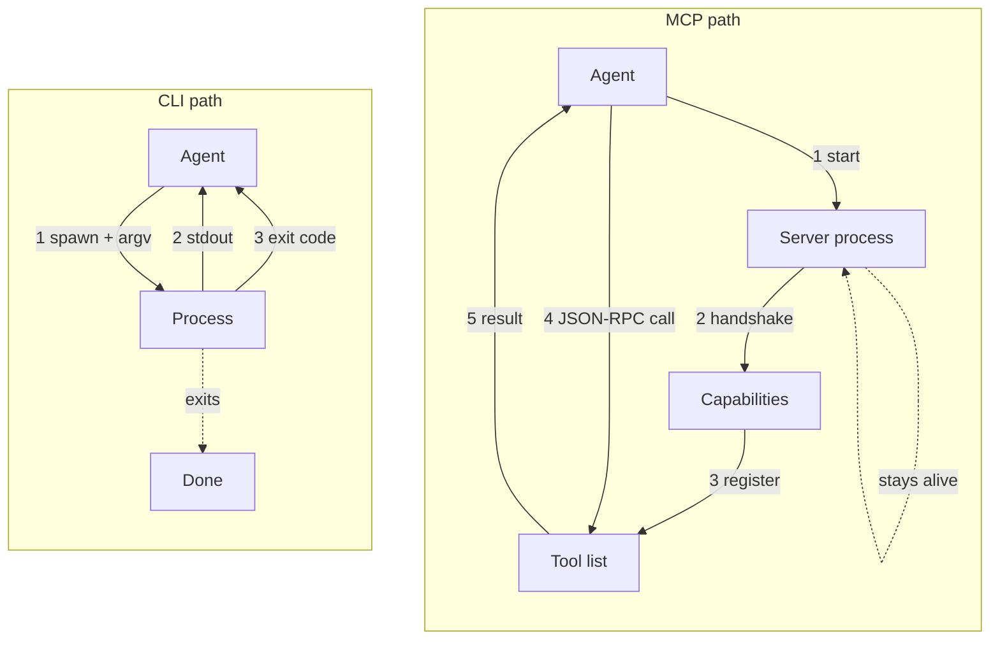
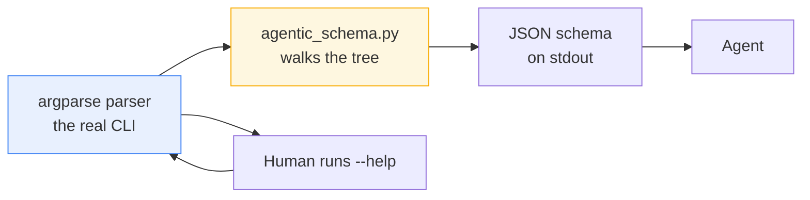

# Why CLIs, not an MCP server

## The short answer

This repo is a local, single-user toolkit, and its agent interface is the same
CLI a human types. Every app emits a machine-readable schema derived directly
from its `argparse` parser. There is no second description of the tools to
write, and no way for one to drift from the other. MCP solves real problems:
hosted capabilities, stateful sessions, streaming. A personal workflow repo on
one laptop has none of them.

This is a *context* argument, not a verdict on MCP. See
[When MCP is the better choice](#when-mcp-is-the-better-choice).

---

## The two paths



The MCP path has a process to start, a handshake to complete, a tool list to
register, and a server to keep alive. The CLI path has a process that runs and
exits. Neither is *better* in the abstract. But the left column is
infrastructure you have to operate, and for a laptop toolkit that cost buys
little.

---

## The schema is derived, not written

The usual objection to CLIs is that agents need structured tool definitions,
and argv is only strings. This repo answers that directly. All 18 apps support

```bash
./bin/mail --agentic --agentic-format json
```

which emits a full machine-readable parser schema: every subcommand, flag,
type, and default. The key property is *where it comes from*:



`src/core/agentic_schema.py` walks the live `argparse` parser and serializes it.
There is no hand-maintained second copy. A flag cannot exist in the schema but
not the CLI, or change meaning in one and not the other, because there is only
one source. The schema is a *view* of the parser, not a description of it.

A well-maintained MCP server gives you the same guarantee. Here you get it by
construction rather than by discipline.

### Size control

The full mail schema runs to about 237&nbsp;KB of JSON. Two flags trim it:

```bash
./bin/mail --agentic --agentic-format json                     # ~237 KB
./bin/mail --agentic --agentic-format json --agentic-compact   # ~153 KB
./bin/mail --agentic --agentic-format json --agentic-domain labels  # ~20 KB
```

`--agentic-compact` strips low-value fields; `--agentic-domain <prefix>` filters
to one subcommand group. An agent that only needs label operations loads 20&nbsp;KB
instead of 237&nbsp;KB. Scope discovery on demand, not upfront.

---

## One surface, two audiences

```bash
./bin/mail labels sync --dry-run              # direct wrapper
./bin/assistant mail labels sync --dry-run    # dispatcher
```

Both reach the same code. `bin/assistant` resolves the app name through
`import_module` in `src/core/assistant_cli.py` and calls the domain module's
`main()`. It does not shell out through the wrappers.

The practical consequence: there is no integration layer. When a human runs
`./bin/mail labels sync` and an agent runs the same string, they exercise
identical code paths. A bug an agent hits is a bug you can reproduce by typing.
There is no "works in the CLI, broken over the protocol" class of failure,
because there is no protocol.

That also makes the tools:

- **Testable without an agent.** `make test` covers the real surface. No
  protocol client, no mock server, no agent in the loop.
- **Greppable.** `grep -rn "labels sync"` finds callers across YAML, docs, and
  shell. Tool invocations are literal text.
- **Composable.** Pipes, `xargs`, `jq`, shell loops. The repo's own workflow
  engine (`src/workflow/compiler.py`) shells out to these same CLIs, making the
  DAG runner one more caller.

---

## Exit codes are the contract

Errors flow through a shared `ExitCode(IntEnum)` in `src/core/cli_errors.py`:

| Code | Name | Meaning |
|-----:|------|---------|
| 0 | `SUCCESS` | Worked |
| 1 | `ERROR` | Generic failure |
| 2 | `USAGE` | Bad arguments |
| 3 | `CONFIG_ERROR` | Missing or invalid config |
| 4 | `AUTH_ERROR` | Credentials rejected |
| 5 | `NETWORK_ERROR` | Transport failed |
| 6 | `NOT_FOUND` | Resource absent |
| 130 | `INTERRUPTED` | Ctrl+C |

```bash
./bin/mail bogus-subcommand; echo $?   # 2
```

An agent can branch on `4` and know to re-authenticate without parsing prose.
So can a shell script, a Makefile, a systemd unit, or a `launchd` plist. This
convention predates every RPC protocol in use today and will outlive the current
ones. That is the argument for building on it.

---

## Nothing to operate

Python 3.11, dependency-light, self-contained. No server to start, no port to
bind, no lifecycle to babysit. No version negotiation between a client and a
server that upgrade separately. Clone the repo and the tools work: see
[getting-started.md](getting-started.md).

For a single-user toolkit, "no daemon" is a feature that keeps paying out.

---

## Honest trade-offs

CLIs are not free. Three real costs:

**Weaker typing at the call boundary.** Everything crosses as argv strings.
MCP's JSON schema contract is genuinely stronger here: the transport enforces
types before your code runs. The `--agentic` schema tells an agent what *should*
be passed, but the boundary is still strings that each CLI validates on its own.

**Process spawn per call.** Every invocation pays interpreter startup. A
long-lived MCP server amortizes that across calls. For interactive personal
workflows this is noise; for a hot loop of thousands of small calls it would not
be.

**The agent needs shell access.** This is the real gate. An agent that cannot
run arbitrary shell commands cannot use any of this. MCP works in sandboxed
environments where shell execution is off the table. That is a categorical
capability difference, not a matter of degree.

---

## When MCP is the better choice

MCP is the right answer when you need any of:

- **Hosted or remote capability.** The tool runs on a server you do not control,
  or must not be replicated to every client machine.
- **Stateful sessions.** Connection pools, warm caches, an open document, or a
  long-lived authenticated context that would be expensive to rebuild per call.
- **Streaming.** Incremental results as they are produced, rather than a single
  stdout dump at process exit.
- **Rich structured content negotiation.** Images, embedded resources, and typed
  content blocks, none of which reduce cleanly to text on a pipe.
- **Distribution to non-cloners.** Users who will never check out a repo, run
  `make venv`, or have a working Python. A protocol endpoint reaches them; a
  `bin/` directory does not.
- **Sandboxed agents.** As above: no shell, no CLI.

None of those describe this repo. It runs on one laptop, for one user, against
local files and personal accounts, driven by an agent that already has a shell.
Under those constraints the CLI is not a compromise. It is the smaller, more
durable, more testable design.

Change the constraints and the answer changes with them. That is the point:
**the choice follows the context, and here the context is local, single-user,
and shell-native.**

---

## See also

- `src/core/agentic_schema.py` — parser walker that derives the schema
- `src/core/agentic.py` — capsule helpers
- `src/core/cli_errors.py` — `ExitCode` and the error hierarchy
- `src/workflow/compiler.py` — the workflow engine shelling out to these CLIs
- `./bin/llm inventory --stdout` — authoritative list of the 18 agentic apps
  and their exact invocations
