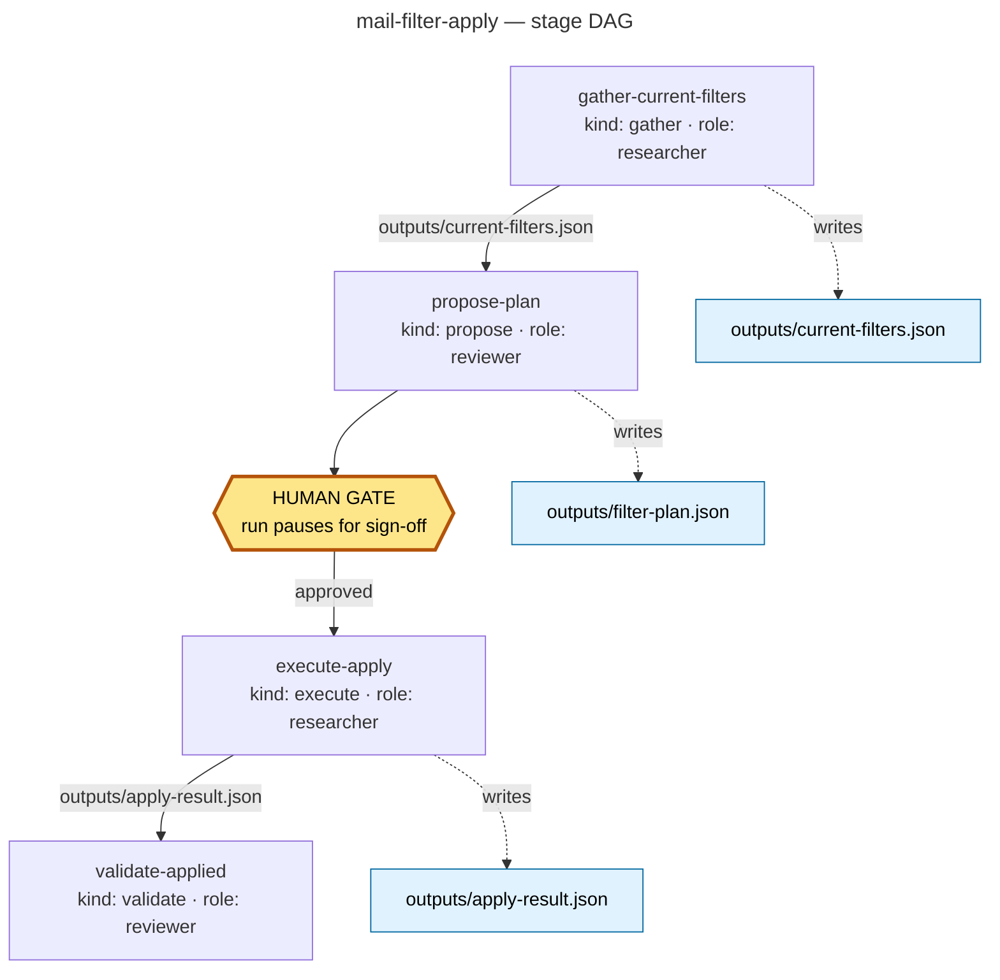
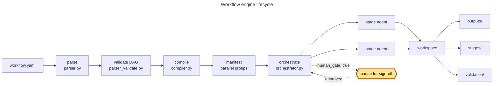

# Workflow Engine

A YAML DAG runner for multi-step tasks. You describe a task as a set of
**stages**; the engine works out what can run in parallel, spawns an agent per
stage, and collects each stage's output files into a run **workspace**.

52 workflows ship with the repo under `workflows/`. Run `./bin/workflow list`
for the authoritative catalog. This doc does not restate it.

New to the repo? Start with [getting-started.md](getting-started.md) for setup.
This doc assumes you can already run `./bin/workflow`.

## Why it exists

The multi-step processes here started as ad-hoc prompt sequences: review a PR,
sweep complexity, tailor a resume, apply mail filters. Re-running one meant
re-deriving the steps, and they drifted every time. A workflow makes the process
a checked-in artifact: same stages, same dependencies, same human sign-off
points on every run.

So **check for an existing workflow before doing multi-step work by hand.**
Reinventing one produces a second, diverging implementation.

```bash
./bin/workflow list | grep -i mail       # narrow by intent
```

## Commands

```bash
./bin/workflow list                        # list available workflows
./bin/workflow lint <file>                 # validate YAML, no execution
./bin/workflow parse <file>                # show parsed structure
./bin/workflow compile <file>              # show the execution plan / parallel groups
./bin/workflow run <file>                  # dry-run (default)
./bin/workflow run <file> --execute        # execute for real
./bin/workflow status <workspace-dir>      # status of a run
```

`run` defaults to **dry-run**. Nothing executes until you pass `--execute`.
Override trigger params with repeatable `--params key=value`:

```bash
./bin/workflow run workflows/mail/mail-filter-apply.yaml \
  --params profile=gmail_personal --params dry_run=true
```

`init-workspace`, `resume`, and `validate-fragment` cover run management; see
`./bin/workflow --help`.

## Anatomy of a workflow

A workflow file has four top-level keys (`name`, `version`, `description`,
`trigger`) plus a list of `stages`.

Each stage carries:

| Field | Purpose |
|---|---|
| `name` | stage identifier, referenced by `depends_on` / `reads_from` |
| `kind` | `gather`, `propose`, `execute`, `validate`, or `publish` |
| `description` | the instruction sent to the agent (see gotcha 1) |
| `agent.role` | which agent definition runs it (`researcher`, `reviewer`, `code-writer`, `tester`, …) |
| `depends_on` | upstream stage names; these form the DAG |
| `reads_from` | upstream stages whose artifacts get wired into this stage's inputs |
| `writes_to` | output filenames this stage produces (see gotcha 2) |
| `human_gate` | `true` pauses the run for sign-off after this stage |
| `validates_output` | `path` + `checks` such as `[is_json, is_dict]` |
| `validation` | `strategy` + `criteria` for `kind: validate` stages |

`depends_on` is the only thing that orders stages. Stages with no dependency
relationship share a parallel group and run concurrently.

## Worked example: mail-filter-apply

`workflows/mail/mail-filter-apply.yaml` is a clean four-stage
gather → propose → gate → execute → validate pipeline.



The header declares the trigger and its default params:

```yaml
name: mail-filter-apply
version: "1.0"
trigger:
  source: manual
  params:
    profile: gmail_personal
    dry_run: "true"
```

Stage 1 gathers state and declares the file it produces. `{profile}` in a
`description` is substituted from trigger params:

```yaml
  - name: gather-current-filters
    kind: gather
    description: >
      Gather the current mail filter state from all providers.
      Run:
        ./bin/mail-assistant filters list -- --format json --profile {profile}
      Write the output to outputs/current-filters.json.
    agent:
      role: researcher
    writes_to:
      - outputs/current-filters.json
```

Stage 2 proposes a plan and stops the run for a human:

```yaml
  - name: propose-plan
    kind: propose
    human_gate: true
    ...
    depends_on: [gather-current-filters]
    reads_from: [gather-current-filters]
    writes_to:
      - outputs/filter-plan.json
```

Stage 3 applies the approved plan and asserts the shape of its own output:

```yaml
  - name: execute-apply
    kind: execute
    ...
    depends_on: [propose-plan]
    validates_output:
      - path: outputs/apply-result.json
        checks: [is_json, is_dict]
```

Stage 4 checks the result against explicit criteria:

```yaml
  - name: validate-applied
    kind: validate
    agent:
      role: reviewer
    validation:
      strategy: unit
      criteria:
        - All planned filters are present in the apply result
        - No unplanned filter deletions occurred
        - apply-result.json contains no error keys
    depends_on: [execute-apply]
    reads_from: [execute-apply]
```

Compiling shows a fully serial chain — each stage depends on the previous, so
`max_parallelism` is 1:

```
$ ./bin/workflow compile workflows/mail/mail-filter-apply.yaml
name: mail-filter-apply
total_stages: 4
total_groups: 4
max_parallelism: 1
```

Drop the `depends_on` edges between independent stages and they collapse into
one group and run together.

## Engine lifecycle



`compiler.py` topologically sorts stages into parallel groups. It isolates any
stage with `human_gate: true` into its own group, so the orchestrator can pause
after it. Stage descriptions invoking a repo CLI compile to a shell command. The
compiler inserts a `--` separator before flags for most CLIs, exempting `llm`
and `docs` via `_NO_SEPARATOR_CLIS` (`src/workflow/compiler.py:37`).

Each stage writes its `writes_to` files under `outputs/` in the run workspace,
plus a per-stage result JSON under `stages/`.

## Authoring gotchas

Two traps `./bin/workflow lint` **cannot** catch. Lint validates structure, and
both are structurally valid.

### 1. `kind: validate` discards `description`

`_validate()` in `src/workflow/dispatch.py:260` builds the agent prompt from
`validation.strategy`, `validation.criteria`, and `validation.domain_rules`
only. It never reads `stage.spec.description`.

A validate stage whose contract lives in its `description` ships an agent prompt
with no contract in it, and still lints clean.

```yaml
# broken — the description is silently dropped
- name: check-output
  kind: validate
  description: Confirm every row has a non-null id.
  validation:
    strategy: unit

# correct — the contract lives in criteria
- name: check-output
  kind: validate
  validation:
    strategy: unit
    criteria:
      - Every row has a non-null id
```

Other kinds route through `_header()`, which emits `description` under a
`## Task` heading. `_validate()` never calls `_header()`. If the instruction does
not fit as criteria, use `kind: execute`.

### 2. `writes_to` gets no `{param}` substitution

`description` gets trigger-param substitution. `writes_to` does not:
`_write_paths()` (`src/workflow/dispatch.py:115`) consumes `stage.spec.writes_to`
verbatim. A `{param}` there becomes a literal filename with braces in it.

```yaml
# broken — creates a file literally named "report-{profile}.json"
writes_to:
  - outputs/report-{profile}.json

# correct — bare filename
writes_to:
  - outputs/report.json
```

Bare filenames resolve under the workspace `outputs/` directory. A path already
prefixed with `outputs/`, `validation/`, `stages/`, or `dispatch/` is used as-is.

## Where to look next

| Path | What |
|---|---|
| `src/workflow/README.md` | module-level architecture and key modules |
| `src/workflow/compiler.py` | topological sort, parallel groups, CLI compilation |
| `src/workflow/dispatch.py` | per-kind agent prompt construction |
| `workflows/` | 52 checked-in workflows to read as examples |

Related skills: `/select-workflow` to find the right one, `/write-workflow` to
author a new one, `/validate-workflow` to check it before committing.
