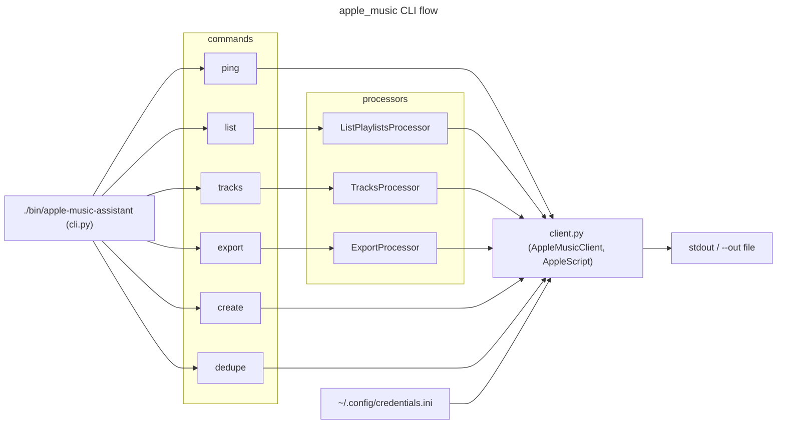

Apple Music Assistant

Overview
- CLI for browsing and exporting Apple Music library data (playlists, tracks).
- Entry point: `./bin/apple-music-assistant`

Key Commands
- List playlists: `./bin/apple-music-assistant list`
- List tracks: `./bin/apple-music-assistant tracks`
- Export library: `./bin/apple-music-assistant export --out out/library.json`
- Create playlist from seeds: `./bin/apple-music-assistant create`

Key Modules
- `cli.py` — command dispatch; `ListPlaylistsProcessor`/`ListPlaylistsProducer`, `TracksProcessor`/`TracksProducer`, `ExportProcessor`/`ExportProducer`
- `cli_helpers.py` — output helpers; JSON output routes through `OutputWriter`
- `cli_playlist.py` — playlist mutation commands
- `client.py` — AppleScript-based music client; `AppleMusicCLIError` subclasses `CLIError`

Architecture

Pipeline Pattern
- Commands route through `SafeProcessor`/`BaseProducer` — see `core/pipeline.py`.
- Request types: `ListPlaylistsRequest`, `TracksRequest`, `ExportRequest`.
- Result types: `PlaylistResult`, `TrackResult`, `ExportPlaylistResult` (frozen dataclasses).
- Auth errors raise `AuthError`; domain errors raise `AppleMusicCLIError`.

Tests
- `tests/apple_music_tests/`
