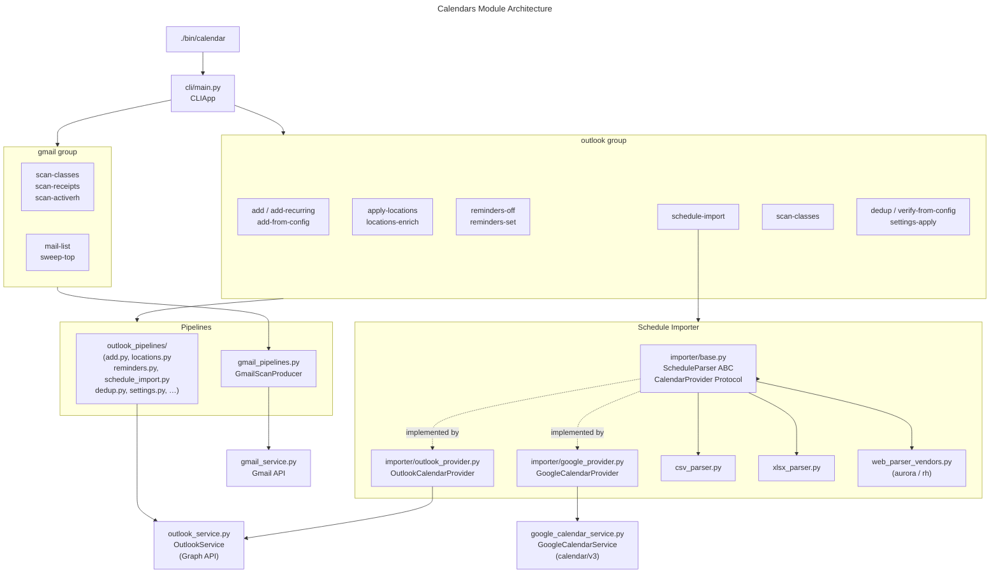

Calendar Assistant

Overview
- Adds single or recurring Outlook events, lists calendar windows, verifies plans, and applies/updates event locations from YAML.
- Scans Gmail for class schedules and receipts to generate calendar plans.

Architecture

Module structure and CLI dispatch:



Key modules:
- `cli/main.py` — CLIApp wiring; `outlook` and `gmail` groups registered here
- `outlook_service.py` — `OutlookService` wrapping `OutlookContext` + Graph API `HttpClient`
- `gmail_service.py` — Gmail API wrapper (lazy import)
- `outlook_pipelines/` — one file per Outlook operation (add, locations, reminders, dedup, settings, schedule_import, …)
- `gmail_pipelines.py` — `GmailScanProducer`; shared scan output for Gmail-based commands
- `importer/base.py` — `ScheduleParser(ABC)`, plus `CalendarProvider(Protocol)`; provider-agnostic event model
- `importer/outlook_provider.py` — `OutlookCalendarProvider`, a production implementor backed by Microsoft Graph.
- `importer/google_provider.py` — `GoogleCalendarProvider`, a production implementor backed by Google Calendar API (calendar/v3). Requires the `https://www.googleapis.com/auth/calendar` scope (shared with the Gmail token in `mail.gmail_api.SCOPES`).
- `google_calendar_service.py` — thin `GoogleCalendarService` wrapper over calendar/v3; lazy-imports googleapiclient.
- `importer/csv_parser.py`, `xlsx_parser.py`, `web_parser_vendors.py` — concrete parsers for schedule-import sources
- `gmail_pipelines.py` — `CalendarEvent` dataclass (shared event model; widened with optional recurrence fields: tz, location, repeat, interval, byday, range, start_time, end_time, exdates, count)

 Key Commands
- Add single: `./bin/calendar --profile outlook_personal outlook add --subject "Soccer" --calendar "Your Family" --start 2025-10-10T17:00 --end 2025-10-10T18:00 --location "Venue (street, city, ST POSTAL)"`
- Add recurring: `./bin/calendar --profile outlook_personal outlook add-recurring --subject "Class" --repeat weekly --byday MO --interval 1 --range-start 2025-10-01 --until 2025-12-15 --start-time 17:00 --end-time 17:30 --location "Name at Facility 123 Main St, City, ST A1A 1A1"`
- Agentic schema: `./bin/calendar --agentic --agentic-format yaml --agentic-compact`
- LLM utilities (calendar): `./bin/llm --app calendar agentic --stdout` | `./bin/llm --app calendar domain-map --stdout` | `./bin/llm --app calendar derive-all --out-dir .llm`
- Suppress reminders: add `--no-reminder` to any create command
- Apply locations from YAML: `./bin/calendar --profile outlook_personal outlook apply-locations --config out/calendar/blas_current.plan.yaml --all-occurrences` (example path; adjust to your plan file)
- Turn off reminders in a window: `./bin/calendar --profile outlook_personal outlook reminders-off --calendar "Your Family" --from 2025-01-01 --to 2025-12-31 --all-occurrences`

Appointment Settings (bulk)
- Apply categories/showAs/sensitivity/reminders from YAML rules across a window:
  - `./bin/calendar --profile outlook_personal outlook settings-apply --calendar "Activities" --from 2025-01-01 --to 2026-06-30 --config config/appointment_settings.yaml --dry-run`
- YAML example:
  ```yaml
  settings:
    defaults:
      show_as: busy
      is_reminder_on: true
      reminder_minutes: 5
    rules:
      - match:
          subject_contains: ["Swim", "Hockey"]
        set:
          categories: ["Kids", "Sports"]
          reminder_minutes: 10
      - match:
          subject_regex: "Parent-Teacher.*"
        set:
          categories: ["School"]
          sensitivity: private
  ```

Reminders Sweep
- Disable reminders across multiple years/calendars using the helper script:
  - `./bin/reminders-off-sweep -p outlook_personal -c "Your Family,Activities" -s 2021 -e 2026`
  - Add `-n` for a dry-run preview.

Schedule Importer (scaffold)
- Import a rec centre schedule into a dedicated calendar from CSV/XLSX (PDF/website planned):
  - `./bin/calendar --profile outlook_personal outlook schedule-import --calendar "Community Centre" --source schedules/fall.csv --kind csv --tz America/Toronto`
- CSV/XLSX columns supported:
  - One-off events: `Subject`, `Start` (YYYY-MM-DDTHH:MM), `End` (YYYY-MM-DDTHH:MM), `Location`, `Notes`
  - Recurring events: `Subject`, `Recurrence` (`weekly`|`daily`|`monthly`), `ByDay` (e.g., `MO,WE` for weekly), `StartTime` (HH:MM 24h), `EndTime`, `StartDate` (YYYY-MM-DD), `Until` (or `EndDate`) or `Count`, `Location` (or `Address`), `Notes`
- Creates the calendar if missing. Use `--dry-run` to preview.
  - Add `--no-reminder` to suppress event reminders/alerts when importing

Plan Export (producer)
- Export Outlook calendar events to a plan YAML — the inverse of `add-from-config`:
  - `./bin/calendar --profile outlook_personal outlook export-plan --calendar "Family" --from 2026-01-01 --to 2026-06-30`
- Recurrence rules are read from the Graph series master (`/me/events/<seriesMasterId>`); `/calendarView` returns expanded occurrences that do not carry a rule.
- Graph pattern types with no plan representation (`relativeMonthly`, `absoluteYearly`, `relativeYearly`) are never dropped silently — they are counted in `result.skipped`. Use `--verbose` to list them.
- Default output resolves via `core.paths.output_dir("calendars")`, outside the checkout — an exported plan contains real calendar contents.

ICS Draft (consumer)
- Turn a plan YAML into an RFC 5545 `.ics` delivered as a Gmail **draft** (never sent):
  - `./bin/calendar outlook ics-draft --config plan.yaml --recipient you@example.com --subject "Calendar Plan"`
- Uses the already-granted `gmail.compose` scope. `--dry-run` prints the ICS without creating a draft.

Pipeline Pattern
- Commands route through `SafeProcessor`/`BaseProducer` — see `core/pipeline.py`.
- `OutlookScanProcessor`/`OutlookScanProducer` added for Outlook scan commands; `GmailScanProducer` (renamed from `GmailPlanProducer`) handles Gmail scan output.
- `CalendarProvider(Protocol)` in `importer/base.py` has two production implementors: `OutlookCalendarProvider` (Microsoft Graph, `importer/outlook_provider.py`) and `GoogleCalendarProvider` (Google Calendar API calendar/v3, `importer/google_provider.py`). Both skip unrepresentable recurrence patterns and record them in `provider.skipped`. `CalendarEvent` dataclass is the shared event model.
- Plan symmetry: `outlook_pipelines/export.py` produces a plan from a calendar; `outlook_pipelines/ics_draft.py` consumes a plan into an ICS Gmail draft. Both use the `SafeProcessor`/`BaseProducer` triad.
- All producer output routes through `OutputWriter`; `CalendarNotFoundError` subclasses `NotFoundError`.

Location Format
- Prefer: `Name (street, city, ST POSTAL)` or `Name at Facility street, city, ST POSTAL`.
- Canadian postal codes with or without space are supported (e.g., `L4G 1J5`).
