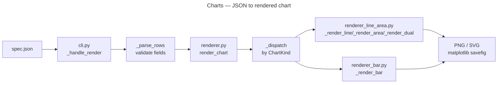

Charts

Overview
- Render time-series charts from JSON data (line, bar, area, dual-axis).
- Entry point: `./bin/charts`

Key Commands
- Render a chart: `./bin/charts render --input spec.json --output out/chart.png`
- Grid layout: `./bin/charts grid --config grid.json --output out/grid.png`
- Reshape data: `./bin/charts reshape --input data.json --x ts --y count --format yaml`

Architecture

`renderer.py` is a re-export shim; rendering logic lives in `renderer_line_area.py` and `renderer_bar.py`. matplotlib is lazily imported so the module is always importable in headless/CI environments.

Key Modules
- `cli.py` — command dispatch; `_handle_render`, `_handle_grid`, `_handle_reshape`; matplotlib loaded lazily

Pipeline Pattern
- Pure in-memory rendering; no SafeProcessor wrapping (no subprocess/network I/O).
- Output routes through `OutputWriter` with `OutputConfig(format=fmt)`.
- Errors raise `CLIError` (`_require_matplotlib()`, `_read_text()`); caught at `main()` via `handle_error()`.

Tests
- `tests/charts_tests/`
