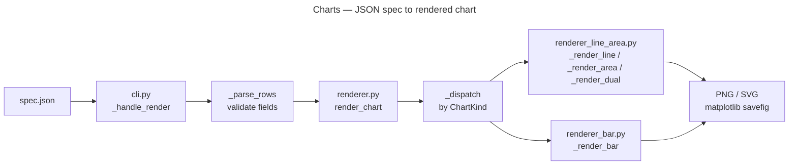

# Charts

Render time-series charts from JSON data: line, bar, area, and dual-axis. Entry point: `./bin/charts`.

Supports `--agentic`: `./bin/charts --agentic --agentic-format yaml --agentic-compact`.

## Key Commands

```bash
./bin/charts render --input spec.json --output out/chart.png
./bin/charts grid --config grid.json --output out/grid.png
./bin/charts reshape --input data.json --x ts --y count --format yaml
```

`reshape` normalizes arbitrary row data into the charts JSON contract and writes to stdout. matplotlib is a required dependency; loaded lazily so the module is importable in headless/CI environments.

## Architecture



`renderer.py` is a re-export shim; rendering logic lives in `renderer_line_area.py` and `renderer_bar.py`.

## Key Modules

- `cli.py` — command dispatch; `_handle_render`, `_handle_grid`, `_handle_reshape`
- `renderer.py` — re-export shim; delegates to `renderer_line_area.py` and `renderer_bar.py`
- `renderer_line_area.py` — `_render_line`, `_render_area`, `_render_dual`
- `renderer_bar.py` — `_render_bar`
- `reshape.py` — data normalization into the charts JSON contract
- `config.py` — chart config and defaults
- `theme.py` — matplotlib theme helpers
- `types/` — chart type definitions (`ChartKind`, spec dataclasses)

## Pipeline Pattern

Pure in-memory rendering; no `SafeProcessor` wrapping (no subprocess or network I/O). Output routes through `OutputWriter` with `OutputConfig(format=fmt)`. Errors raise `CLIError` (caught at `main()` via `handle_error()`).

## Tests

`tests/charts_tests/`
