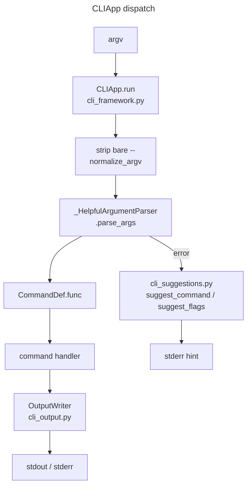
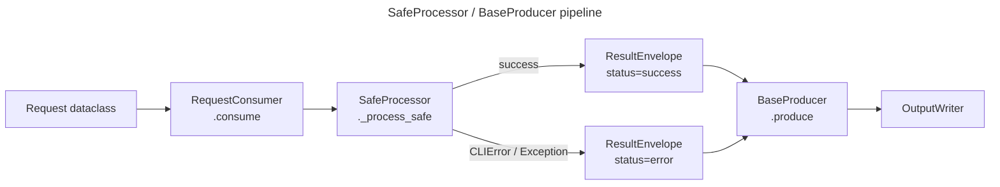

# Core

Shared scaffolding for all domain CLIs: the `CLIApp` dispatch framework, pipeline abstractions, auth helpers, I/O utilities, and LLM capsule tooling. No CLI of its own — imported by every other package.

## Architecture

`CLIApp` is the command-registration and dispatch layer used by all domain CLIs. The `SafeProcessor`/`BaseProducer` pipeline is used within command handlers for I/O-bound operations (subprocess, network, file rendering).

## Modules

**CLI framework**
- `cli_framework.py` — `CLIApp`: command registration (`@app.command`), argv normalization, `run()` / `run_with_assistant()`. Strips bare `--` tokens automatically.
- `cli_framework_group.py` — `CommandGroup`, `quick_cli`: subcommand group builder.
- `cli_framework_types.py` — `CommandDef`, `Argument` dataclasses.
- `cli_framework_parser.py` — `_HelpfulArgumentParser` with error suggestions.
- `cli_errors.py` — `CLIError`, `ConfigError`, `AuthError`, `NetworkError`, `ExitCode`.
- `cli_output.py` — `OutputWriter`: structured stdout/stderr routing.
- `cli_suggestions.py` — `suggest_command`, `suggest_flags`.
- `cli_help_text.py` — help text formatting helpers.
- `cli_args.py` — shared argparse builders for Gmail/Outlook auth flags; `OutputFormatConfig` (`OutputConfig` alias retained for compatibility).

**Pipeline**
- `pipeline.py` — `SafeProcessor`, `BaseProducer`, `ResultEnvelope`, `RequestConsumer`. `BaseProducer` injects `OutputWriter` via `__init__`; `print_error`/`print_logs` are instance methods.

**Auth**
- `auth.py` — `build_gmail_service()`, `build_outlook_service(OutlookServiceConfig)`, `*_from_args` helpers.
- `outlook/` — `OutlookClient` (calendar + mail mixins), `OutlookBaseProvider` protocol, request models.

**LLM capsule tooling**
- `agentic.py` — agentic capsule helpers (CLI tree, section building).
- `agentic_schema.py` — parser-to-JSON/YAML schema extraction (`_build_node`, `_collect_leaf_options`).
- `assistant.py` — base assistant flags + capsule emit helper.
- `assistant_cli.py` — assistant dispatcher entry point.
- `llm_cli.py` — `llm` CLI: inventory, familiar, flows, policies, domain-map.
- `llm_builders.py` — `DomainLlmConfig`, `make_domain_llm_module` factory.
- `llm_domain.py` — domain-map emission helpers.
- `llm_handlers.py` — staleness scan and inventory emit.
- `llm_staleness.py` — stale-context detection.
- `meta_base.py` — `AppMeta` dataclass: agentic/domain-map/familiar fallbacks per domain.

**I/O utilities**
- `context.py` — `AppContext`: lightweight args/config/root-path carrier.
- `textio.py` — UTF-8 read/write helpers.
- `yamlio.py` — YAML read/write; errors raise `CLIError`.
- `fileutil.py` — `atomic_write_json`, `safe_load_json`, `find_rotated_files`, `iter_jsonl_file`; errors raise `CLIError`.
- `text_utils.py` — `strip_css_boilerplate`, `html_to_text`, `normalize_unicode`, `truncate_text`, time-range parsing.
- `date_utils.py` — `normalize_day`, `parse_month`, `parse_window`, `now_utc`.
- `constants.py` — `credential_ini_paths`.
- `collections.py` — `dedupe`.
- `parallel.py` — `chunked`, `parallel_map`.
- `cache.py` — `ConfigCacheMixin`: JSON cache with TTL.
- `patterns.py` — shared regex patterns for HTML and time-expression parsing.

**Network / secrets**
- `http.py` — `HttpClient`: requests-based HTTP with retry, timeouts, secret masking.
- `secrets.py` — `mask_text`, `mask_headers`, `mask_url`.
- `gh_cli.py` — `GhCLI`: thin `gh` CLI wrapper for JSON-friendly api/graphql/pr calls; errors raise `CLIError`.
