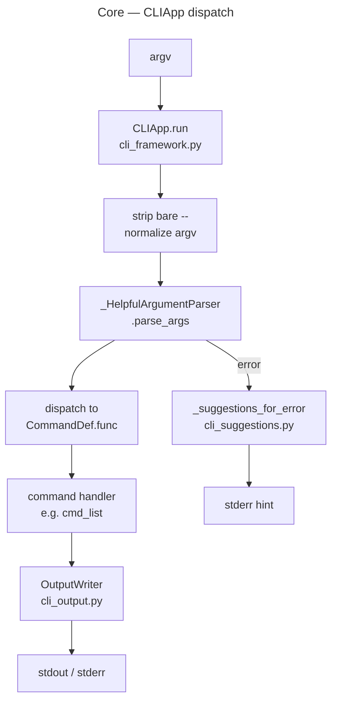
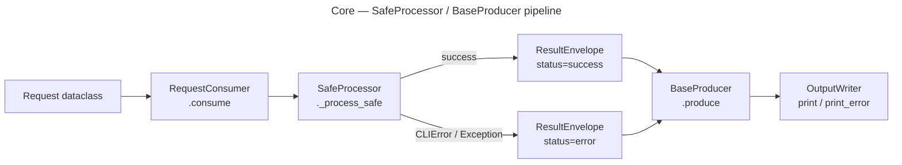

# Core Modules

Shared scaffolding for all assistants plus lightweight utilities used across CLIs.

## Architecture

`CLIApp` (first diagram) is the command-registration + dispatch layer used by all domain CLIs. The `SafeProcessor`/`BaseProducer` pipeline (second diagram) is used within command handlers for I/O-bound operations (subprocess, network, file rendering).

## Modules

- `pipeline.py` — pipeline patterns: `SafeProcessor` (automatic error handling), `BaseProducer` (template method for output), `ResultEnvelope`, and `RequestConsumer` type alias.
- `context.py` — lightweight `AppContext` used to pass args/config/root paths.
- `testing.py` — reusable stubs to exercise individual stages in unit tests.
- `agentic.py` — agentic capsule helpers (CLI tree, section building).
- `textio.py` — UTF-8 read/write helpers.
- `yamlio.py` — YAML read/write helpers.
- `auth.py` — shared Gmail/Outlook auth resolution and service builders (including `*_from_args` helpers).
- `cli_args.py` — shared argparse builders for Gmail/Outlook auth flags.
- `assistant.py` — base assistant flags + capsule emit helper.
- `assistant_cli.py` — assistant dispatcher entry point.
- `llm_cli.py` — LLM CLI helpers (inventory, familiar, flows, policies).
- `http.py` — `HttpClient`: thin requests-based HTTP client with retry, timeouts, and secret masking.
- `secrets.py` — secret redaction helpers (`mask_text`, `mask_headers`, `mask_url`) and output masking.
- `gh_cli.py` — `GhCLI`: thin wrapper around the `gh` CLI for JSON-friendly calls (api/graphql/pr view/list/search), with error masking.

Recent changes (design-criteria-normalize, 2026-07-30)
- `pipeline.py` — `BaseProducer` now injects `OutputWriter` via `__init__`; `print_error`/`print_logs` are instance methods (not static).
- `cli_args.py` — `OutputConfig` renamed to `OutputFormatConfig`; `OutputConfig` alias retained for backwards compatibility.
- `gh_cli.py`, `yamlio.py`, `fileutil.py` — `RuntimeError`/`sys.exit` replaced with `CLIError`.
- `outlook/__init__.py` — exports `OutlookBaseProvider(Protocol)` from `outlook/base.py`.
- `auth.py` — `build_outlook_service()` takes an `OutlookServiceConfig` directly.

Assistants should compose these pieces instead of rebuilding bespoke plumbing so that CLI
shims stay thin and domain logic stays easy to test.
