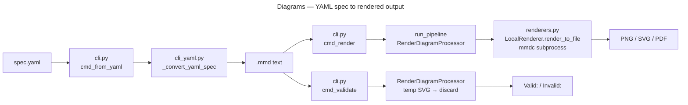

# Diagrams

Mermaid diagram generation from YAML specs or telemetry data. Entry point: `./bin/diagrams`.

Supports `--agentic`: `./bin/diagrams --agentic --agentic-format yaml --agentic-compact`.

## Key Commands

```bash
./bin/diagrams from-yaml --input spec.yaml --output out/diagram.mmd
./bin/diagrams from-yaml --input spec.yaml --embedded    # wrap in ```mermaid fence
./bin/diagrams render --input diagram.mmd --output out/diagram.png
./bin/diagrams validate --input diagram.mmd              # check syntax via mmdc
./bin/diagrams embed --input spec.yaml --from-yaml       # emit fenced mermaid block
./bin/diagrams health                                    # check mmdc is installed
./bin/diagrams telemetry cost-pie --days 7
./bin/diagrams telemetry token-pie --days 7
./bin/diagrams telemetry timeline --days 7
```

`render` and `validate` require [mmdc](https://github.com/mermaid-js/mermaid-cli) on `PATH`.

## Architecture



`cmd_render` routes through `SafeProcessor`/`BaseProducer` via `run_pipeline`. `cmd_validate` calls `RenderDiagramProcessor().process()` directly against a throwaway SVG in a temp dir; the rendered artifact is discarded and only a `Valid:`/`Invalid:` line is written to stderr.

## YAML Spec Format

A minimal spec:

```yaml
type: flowchart    # "flowchart" (default) or "sequence"
direction: LR      # flowchart only: TB, LR, BT, RL
nodes:
  - id: A
    label: Input
  - id: B
    label: Output
edges:
  - from: A
    to: B
```

`type` defaults to `flowchart` when omitted. `gantt` and `pie` are available via the Python builder API (`mermaid.py`) but are not supported via YAML spec.

## Key Modules

- `cli.py` — command dispatch: `cmd_from_yaml`, `cmd_render`, `cmd_validate`, `cmd_embed`, `cmd_health`, `cmd_telemetry`
- `cli_yaml.py` — `_convert_yaml_spec`: YAML → `.mmd` text
- `cli_telemetry.py` — telemetry diagram commands (`cost-pie`, `token-pie`, `timeline`)
- `renderers.py` — `LocalRenderer` wraps mmdc subprocess; `RenderDiagramProcessor(SafeProcessor)` / `RenderDiagramProducer(BaseProducer)`; `LocalRendererError` subclasses `CLIError`
- `mermaid.py` — Mermaid syntax helpers
- `dark_mode.py` — dark-mode theme injection for mmdc

## Tests

`tests/diagrams_tests/`
