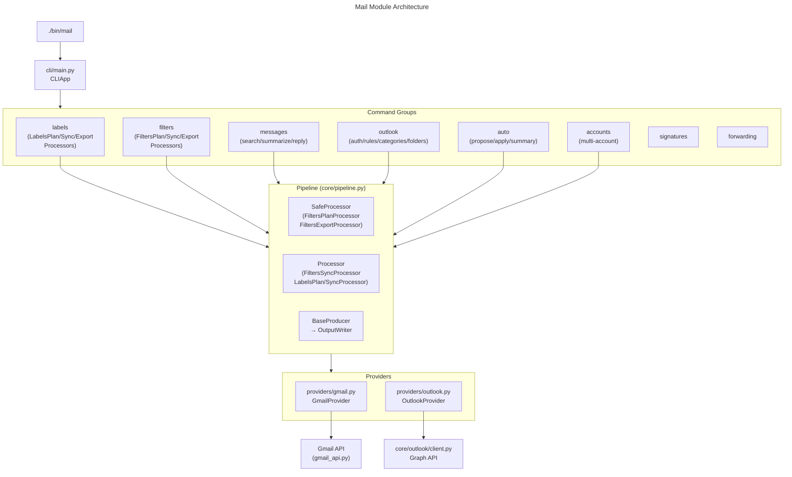
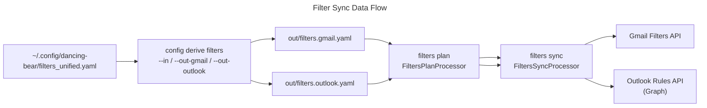

Mail Assistant

Overview
- Gmail/Outlook CLI for labels, filters/rules, signatures and cache helpers.
- Uses profiles in `~/.config/credentials.ini` (e.g., `--profile gmail_personal`, `--profile outlook_personal`).

Architecture

Module structure and CLI dispatch:

Filter config data flow (unified YAML → provider sync):

Key modules:
- `cli/main.py` — CLIApp wiring; all groups and subcommands registered here
- `providers/gmail.py`, `providers/outlook.py` — `BaseProvider` subclasses; implement labels/filters/messages
- `gmail_api.py` — low-level Gmail REST wrapper (lazy import)
- `core/outlook/client.py` — Graph API client (lazy import, MSAL auth); call sites import `OutlookClient` directly from `core.outlook`
- `filters/processors_plan.py` — `FiltersPlanProcessor`, `FiltersSyncProcessor`, `FiltersExportProcessor`
- `filters/processors_sweep.py` — `FiltersSweepProcessor`, `FiltersPruneProcessor`
- `labels/processors.py` — `LabelsPlanProcessor`, `LabelsSyncProcessor`; producers in `labels/producers.py` (`LabelsPlanProducer`, `LabelsSyncProducer`, `LabelsExportProducer`)
- `auto/processors.py` — `AutoProposeProcessor`, `AutoApplyProcessor`
- `accounts/pipeline.py` — multi-account fan-out over configured providers
- `config_cli/pipeline_derive.py` — unified YAML → per-provider YAML derivation

Quick Start
- Venv: `make venv`
- Help: `./bin/mail --help`
- Agentic schema (LLM): `./bin/mail --agentic --agentic-format yaml --agentic-compact`
- LLM utilities wrapper: `./bin/llm agentic --stdout` (or `--write .llm/AGENTIC.md`)
- Initialize LLM meta: `./bin/llm derive-all --out-dir .llm` (or `--stdout`). Generated files (AGENTIC.md, DOMAIN_MAP.md) are built on demand; pass `--include-generated` to write them.
- LLM domain map: `./bin/llm domain-map --stdout` (or `--write .llm/DOMAIN_MAP.md`)
- LLM inventory (JSON): `./bin/llm inventory --format json --stdout`
- Gmail export filters: `./bin/mail --profile gmail_personal filters export --out out/filters.gmail.export.yaml`
- Gmail sync filters: `./bin/mail --profile gmail_personal filters sync --config out/filters.gmail.from_unified.yaml --dry-run`
- Outlook rules plan: `./bin/mail --profile outlook_personal outlook rules.plan --config out/filters.outlook.yaml`

Outlook Authentication (first time)
- Device-code flow (recommended):
  - Start: `./bin/mail --profile outlook_personal outlook auth.device-code`
  - Complete the on-screen link/code, then persist token:
    `./bin/mail --profile outlook_personal outlook auth.poll --flow ~/.config/msal_flow.json --token ~/.config/outlook_token.json`
- One-liner (silent if cache exists):
  - `./bin/mail --profile outlook_personal outlook auth.ensure`

Profiles
- Configure credentials/token paths and Outlook client ID via `~/.config/credentials.ini` under sections:
  - `[mail.gmail_personal]` → `credentials`, `token`
  - `[mail.outlook_personal]` → `outlook_client_id`, `tenant`, `outlook_token`

Pipeline Pattern
- Filter/label commands route through `SafeProcessor`/`BaseProducer` — see `core/pipeline.py`.
- `FiltersPlanProcessor`, `FiltersImpactProcessor`, `FiltersExportProcessor`, `AutoProposeProcessor`, `AutoSummaryProcessor`, `AutoApplyProcessor` use `SafeProcessor`.
- All producer output routes through `OutputWriter`; bare `print()` eliminated in `filters/producers.py` and `labels/producers.py`.
- CLI-boundary errors raise `UsageError` or `CLIError` (not `ValueError`/`RuntimeError`).

Notes
- Optional deps lazily imported: Google API client, PyYAML, MSAL, requests.
- Keep YAML human-editable; unknown keys are ignored on sync.
