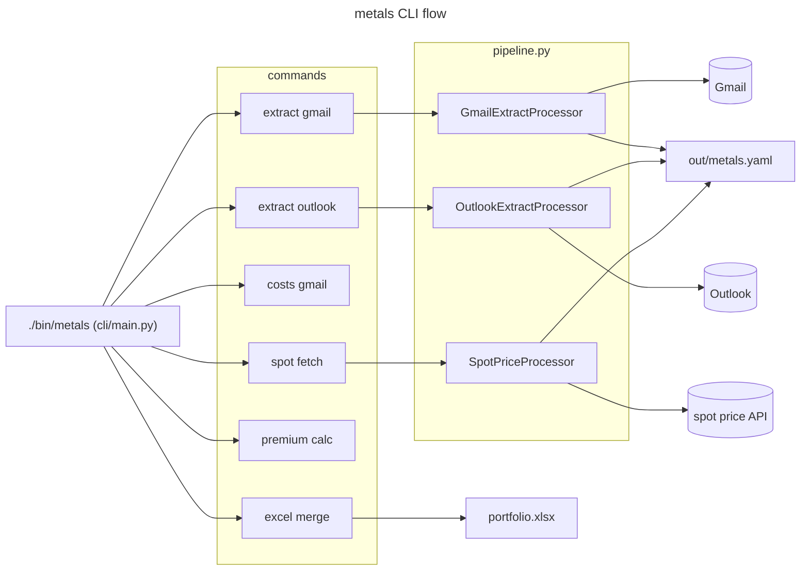

Metals Assistant

Overview
- Precious metals purchase tracking: spot price fetches, Gmail/Outlook cost extraction, and Excel summaries.
- Entry point: `./bin/metals`

Key Commands
- Spot prices: `./bin/metals spot fetch --metal gold`
- Gmail cost extraction: `./bin/metals costs gmail --profile gmail_personal`
- Outlook cost scan: `./bin/metals costs outlook --profile outlook_personal`
- Premium analysis: `./bin/metals premium calc`

Key Modules
- `pipeline.py` — `SpotPriceProcessor`/`SpotPriceProducer`, `GmailCostsProcessor`/`GmailCostsProducer`, `OutlookCostsProcessor`/`OutlookCostsProducer`, `ExtractProducer`
- `cli/main.py` — command dispatch; `cmd_spot_fetch`, `cmd_costs_gmail`, `cmd_costs_outlook` use processor pipeline
- `spot.py` — spot price fetching; output via injected `OutputWriter`
- `gmail_extract.py` — Gmail cost extraction; output via injected `OutputWriter`
- `excel_chart.py` — Excel summary generation
- `outlook_scan.py` — Outlook cost scanning

Architecture

Pipeline Pattern
- Commands route through `SafeProcessor`/`BaseProducer` — see `core/pipeline.py`.
- Missing credentials raise `CLIError`; bare `except` blocks annotated `# nosec B110/B112`.
- Output routes through `OutputWriter` in all producers and helper `run()` methods.

Tests
- `tests/metals_tests/`
