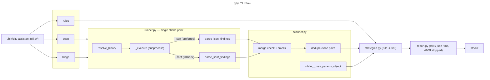

# qlty Assistant

Wraps the external `qlty` binary so its findings are discoverable in one call, with a
per-rule remediation strategy attached. Classification only — this domain never edits code.

## Usage

```
./bin/qlty-assistant scan
./bin/qlty-assistant scan --changed --format json
./bin/qlty-assistant scan --expect-min 1 --rescan-until-stable
./bin/qlty-assistant scan --smells-only --rule file-complexity --format json src/
./bin/qlty-assistant scan --smells-only --rule file-complexity --rule boolean-logic
./bin/qlty-assistant triage
./bin/qlty-assistant rules --counts
```

`--rule` is repeatable. An unknown rule name yields zero findings, not an error.
`--expect-min` applies to the raw scan total (pre-filter) so `--rule` never trips
the worktree-exclusion guard.

Never invoked as `./bin/qlty` — that would shadow the real binary on `PATH`.

## Why this exists

Raw `qlty` has five sharp edges, each hit in practice:

| | Failure | Mitigation here |
|---|---|---|
| F1 | `check` defaults to changed-files-only; "No issues" on a clean branch is indistinguishable from a clean repo | `scan` defaults to `--all`; `--changed` says so explicitly when empty |
| F2 | `check` (lint/security) and `smells` (structure) are disjoint; neither is a superset | `scan` runs both and merges |
| F3 | `smells` emits ANSI even when piped | every renderer strips ANSI |
| F4 | `--json` works but is undocumented (only `--sarif` is advertised) | `runner.py` prefers JSON, falls back to SARIF, **normalizes both** |
| F5 | findings are capped per run, so a big cluster hides findings elsewhere | `--rescan-until-stable`; counts are never presented as complete |

## Architecture



## The normalization contract

The two wire formats disagree, so `runner.py` normalizes rather than passing through:

| | `--json` | `--sarif` |
|---|---|---|
| shape | flat array | `runs[0].results[]` |
| rule id | `function-parameters` | `qlty:function-parameters` |
| numeric value | `value` field | absent (embedded in message text) |

Without stripping the `qlty:` prefix, a fallback yields rule keys matching nothing in
the strategy table and every finding silently classifies as "unknown rule".

**Invariant:** a parse failure and a clean repo must never produce the same value. An
empty finding set from a parse error raises; an empty set from a clean repo returns `[]`.

## Tiers

`strategies.py` maps each rule to an action class. The tier, not the count, decides
what happens to a finding.

| Tier | Meaning | Rules |
|---|---|---|
| A | mechanical, safe to fan out | `file-complexity`, `function-complexity`, `boolean-logic` |
| B | judgment required; default LEAVE | `function-parameters` |
| C | false positive; suppress with a stated reason | any rule, case by case |
| D | read required; reported, never auto-fixed | `similar-code`, `return-statements` |

Two calibrations are baked in, both from triaging this repo:

- **`function-parameters` is not ranked by count.** A read-only pass over 31 findings
  returned 29 LEAVE / 2 FIX — fixture factories and framework-injected handlers are
  *correct* with many defaulted kwargs. The 2 real fixes were **pattern drift**, so
  `triage` cross-references whether siblings in the same module already use a params
  object. That check is what separates signal from noise.
- **`similar-code` gets no auto-proposed fix.** The hasher matches on structure and
  size: the highest-mass finding in this repo (157) was a false positive whose "obvious"
  fix would have merged a day→RRULE dict with a subcommand→help-text dict. Findings are
  surfaced with every location for a human to read. Genuine duplication found that way
  is still worth fixing.

## Worktree caveat

`.qlty/qlty.toml` excludes `**/.claude/**`. Agents spawned with `isolation: "worktree"`
land in `.claude/worktrees/` and get a **silently empty scan** — 0 issues means
*excluded*, not *clean*. Use `--expect-min N` to make that fail loudly instead of
reading as success.

## Testing

`tests/qlty_tests/` is fixture-driven against captured JSON and SARIF
(`tests/qlty_tests/fixtures/`). No live `qlty` calls — its output format is exactly
what this wrapper does not control, so the fixtures pin the contract.
