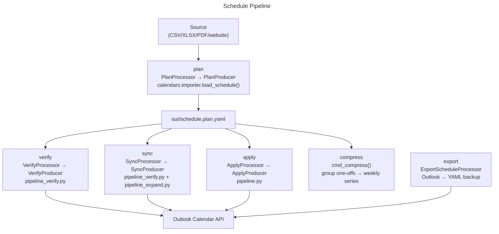

# Schedule Assistant

## Overview

Lightweight plan/verify/sync helpers for schedule plans (Outlook-focused). For bulk imports, use the Calendar CLI schedule import to create Outlook events from CSV/XLSX/PDF/website inputs.

## Architecture

All commands route through `SafeProcessor`/`BaseProducer` from `core/pipeline.py`. Errors raise `CLIError`; apply defaults to dry-run unless `--apply` is passed.

## Recommended Commands
- Import schedules into a dedicated calendar:
  - `./bin/calendar --profile outlook_personal outlook schedule-import --calendar "Community Centre" --source schedules/fall.csv --kind csv --tz America/Toronto`
- Plan to YAML (ephemeral):
  - `./bin/schedule-assistant plan --source schedules/fall.csv --out out/schedule.plan.yaml`
- Apply from plan (dry-run by default):
  - `./bin/schedule-assistant apply --plan out/schedule.plan.yaml --dry-run`
  - `./bin/schedule-assistant apply --plan out/schedule.plan.yaml --apply --calendar "Your Family"`
- Verify plan against Outlook:
  - `./bin/schedule-assistant verify --plan out/schedule.plan.yaml --calendar "Your Family" --from 2025-10-01 --to 2025-12-31`
- Sync plan to Outlook (dry-run by default):
  - `./bin/schedule-assistant sync --plan out/schedule.plan.yaml --calendar "Your Family" --from 2025-10-01 --to 2025-12-31`
- LLM capsules (agentic/domain-map/familiar/policies):
  - `./bin/llm --app schedule agentic --stdout`
  - `./bin/llm --app schedule domain-map --stdout`
  - `./bin/llm --app schedule derive-all --out-dir .llm --include-generated --stdout`
- Notes:
  - Write plans to `out/` (tracked).

Pipeline Pattern
- All commands route through `SafeProcessor`/`BaseProducer` — see `core/pipeline.py`.
- `ExportScheduleProcessor`/`ExportScheduleProducer` added in this cycle; `PlanProducer`, `VerifyProducer`, `SyncProducer`, `ApplyProducer`, `ExportScheduleProducer` all inject `OutputWriter`.
- Errors raise `CLIError` (not `ValueError`/`RuntimeError`); broad `except` blocks narrowed to `(ImportError, OSError, ValueError)`.

Notes
- When the Schedule Assistant CLI becomes available, this wrapper (`./bin/schedule-assistant`) will invoke it directly.
- Keep inputs under `config/` or a local `schedules/` folder; write outputs to `out/`.
