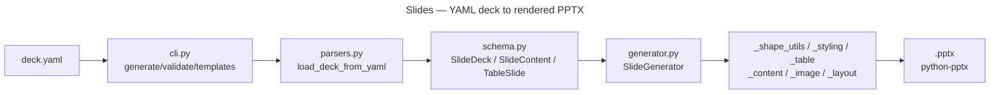

# Slides

Generate PowerPoint decks from YAML definitions. Entry point: `./bin/slides`.

Supports `--agentic --agentic-format json` (auto-derived schema).

## Key Commands

```bash
./bin/slides generate deck.yaml --template template.pptx -o out/deck.pptx
./bin/slides validate deck.yaml
./bin/slides templates template.pptx --format table
```

A template `.pptx` is **required** — via `--template` or `template_path:` in
the deck YAML — because no default template ships with the repo (any real
template carries branding). Missing template raises a clear error, not a
traceback. `--template` overrides `template_path:` when both are present.

`mermaid:` slides shell out to `mmdc` (`npm install -g @mermaid-js/mermaid-cli`)
at generation time; a missing binary raises `RuntimeError`, never a silent
skip. Decks without `mermaid:` slides need nothing installed.

Install the optional extra before use — `pip install -e ".[slides]"` — into
the venv `make test` runs against (`.venv/bin/pip`), not system Python.

## Deck YAML Example

```yaml
title: Q3 Review
author: Brian Sherwin
date: 2026-08-21
template_path: template.pptx
slides:
  - title: Highlights
    layout: bullet
    bullets:
      - Plain string bullet
      - text: Dict bullet with formatting
        level: 1
        bold: true
      - ["List-form bullet", 1]      # [text, level?]
  - title: Results
    layout: table
    headers: [Metric, Value]
    rows: [[Revenue, "$1.2M"], [Churn, "2%"]]
```

See `concerns/slides-yaml.md` for the full silent-failure catalog (dropped
bullet types, missing `slides:` key, layout typos, etc.).

## Architecture



## Key Modules

- `cli.py` — command dispatch: `generate`, `validate`, `templates`
- `parsers.py` — YAML/Markdown/CSV/outline loaders into `SlideDeck`
- `schema.py` — `SlideDeck`, `SlideContent`, `TableSlide`, `BulletItem`, `DeckMetadata`
- `generator.py` — `SlideGenerator`, composed from six mixins:
  - `_shape_utils.py` — shape/placeholder helpers
  - `_styling.py` — theme colors, fonts, highlight/bold runs
  - `_table.py` — table slide rendering
  - `_content.py` — bullet/text slide population
  - `_image.py` — image and Mermaid-diagram slides (shells out to `mmdc`)
  - `_layout.py` — template layout resolution, `layout_map`
- `constants.py` — `VALID_LAYOUTS`, YAML key names, defaults
- `agentic.py` — `--agentic` capsule
- `meta.py` — `AppMeta` (app id, purpose, example command)

## Not Included

Google Slides / Drive publishing is deferred pending an OAuth scope decision.
The Slides API cannot ingest a `.pptx`, so a native backend would be a second
renderer, not a swap for this one.

## Tests

`tests/slides_tests/`
