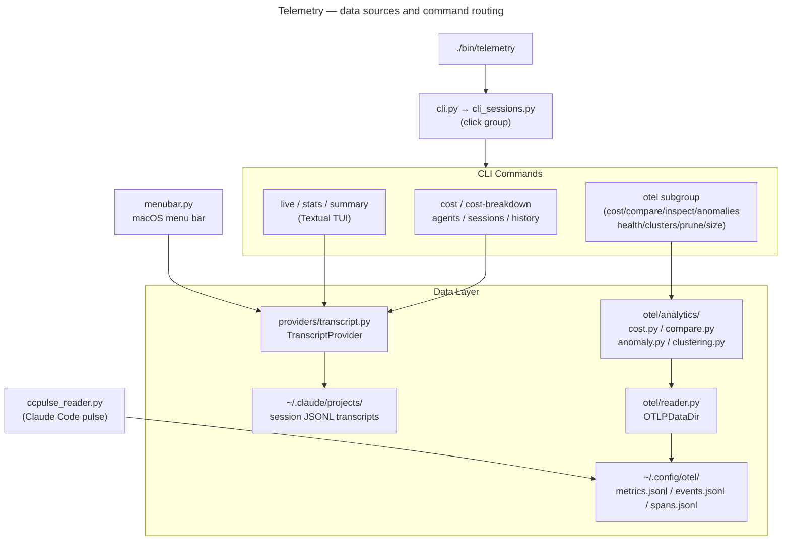

# Telemetry

Claude Code session analysis: cost tracking, token usage, session browsing, transcript parsing, and OTEL integration. Entry point: `./bin/telemetry`.

Does not support `--agentic`; discover subcommands with `./bin/telemetry --help`.

## Key Commands

```bash
./bin/telemetry cost --since 7d             # per-agent or per-day cost breakdown
./bin/telemetry cost-breakdown --since 7d   # alias for cost
./bin/telemetry sessions --limit 20         # list sessions with cost and token breakdown
./bin/telemetry agents                      # per-agent token and cost breakdown
./bin/telemetry history                     # recent sessions in a Rich table
./bin/telemetry live                        # live TUI dashboard (refreshes continuously)
./bin/telemetry stats                       # compact real-time session metrics
./bin/telemetry summary                     # one-shot session summary
./bin/telemetry parse-transcripts           # pre-parse JSONL transcripts to structured JSON
./bin/telemetry rules                       # manage telemetry classification rules
./bin/telemetry otel cost                   # OTEL cost scan
./bin/telemetry otel compare <a> <b>        # cross-session comparison
./bin/telemetry otel inspect                # inspect OTEL data
./bin/telemetry otel anomalies              # anomaly detection
./bin/telemetry otel health                 # data health check
./bin/telemetry otel clusters               # session clustering
./bin/telemetry otel prune                  # prune old OTEL data
./bin/telemetry otel size                   # OTEL data size report
```

The OTLP collector is a standalone script (not routed through the telemetry CLI):
```bash
python3 -m telemetry.otel.collector --daemon   # start collector
python3 -m telemetry.otel.collector --stop
python3 -m telemetry.otel.collector --status
```

## Architecture



## Key Modules

- `cli.py` — thin shim; imports from `cli_sessions.py` and `cli_formatters.py`
- `cli_sessions.py` — click command group; all top-level subcommands
- `cli_formatters.py` — pure formatting helpers; no I/O side effects
- `_cli_sessions.py`, `_cli_agents.py` — click command implementations
- `providers/transcript.py` — `TranscriptProvider`; parses Claude Code JSONL under `~/.claude/projects`
- `parser.py`, `_transcript_record_parser.py` — transcript record parsing
- `parse_transcripts.py` / `parse_transcripts_io.py` / `parse_transcripts_emit.py` — `parse-transcripts` command
- `pricing.py` — model cost lookups
- `classify.py`, `rules.py` — session classification rules
- `blame.py` — per-agent cost attribution
- `otel/reader.py` — `OTLPDataDir`; locates `~/.config/otel/` files
- `otel/cli/cost.py` — `CostScanProcessor` / `CostScanProducer` for `telemetry otel cost`
- `otel/analytics/cost.py` — `get_all_costs`, `get_daily_costs`, `get_model_performance`
- `otel/analytics/compare.py`, `anomaly.py`, `clustering.py` — cross-session analysis
- `collector.py` — `CollectorReadProcessor`; manages docker-compose OTLP collector lifecycle
- `ccpulse_reader.py` — reads Claude Code pulse data into OTEL files
- `menubar.py` and `_menubar_*.py` — macOS menu bar status display
- `tui/` — Textual TUI components for `live` / `stats` / `summary`

## Tests

`tests/telemetry_tests/`
