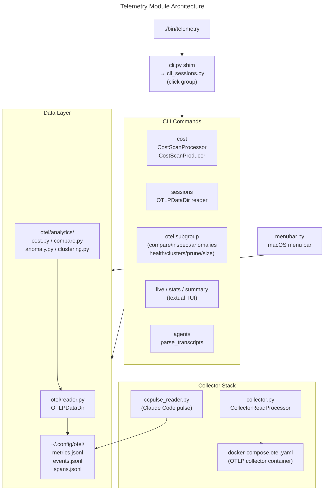

Telemetry Assistant

Overview
- Claude Code session telemetry: cost tracking, token usage, session browsing, and transcript parsing.
- Entry point: `./bin/telemetry`

Architecture

Module structure and data flow:

Key modules:
- `cli.py` — thin shim re-exporting from `cli_sessions.py` and `cli_formatters.py`
- `cli_sessions.py` — click command group with `cost_breakdown`, `sessions`, `otel_cmd`, `live`, `stats`, `summary`, `agents`, `history`, `rules`
- `cli_formatters.py` — pure formatting helpers; no I/O side effects
- `otel/reader.py` — `OTLPDataDir`; locates `~/.config/otel/metrics.jsonl`, `events.jsonl`, `spans.jsonl`
- `otel/cli/cost.py` — `CostScanProcessor` / `CostScanProducer` (pipeline pattern)
- `otel/analytics/cost.py` — `get_all_costs`, `get_daily_costs`, `get_model_performance`
- `otel/analytics/compare.py`, `anomaly.py`, `clustering.py` — cross-session analysis
- `collector.py` — `CollectorReadProcessor`; manages docker-compose OTLP collector lifecycle
- `ccpulse_reader.py` — reads Claude Code pulse data into OTLP files
- `menubar.py` — macOS menu bar status helper (reads from data layer)

Key Commands
- Cost breakdown: `./bin/telemetry cost --days 7`
- Session browser: `./bin/telemetry sessions --limit 20`
- Compare sessions: `./bin/telemetry otel compare <session_a> <session_b>`
- OTLP collector (standalone script, not routed through the telemetry CLI):
  `python3 -m telemetry.otel.collector --daemon` / `--stop` / `--status`

Pipeline Pattern
- Commands route through `SafeProcessor`/`BaseProducer` — see `core/pipeline.py`.
- All output routes through `OutputWriter`; bare `print()` eliminated.
- `sys.exit()` replaced with `raise CLIError(...)` at all non-POSIX boundaries.

Tests
- `tests/telemetry_tests/`
