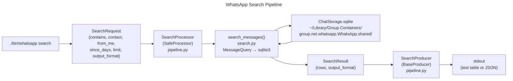

# WhatsApp Assistant

## Overview

Local-only CLI for searching ChatStorage message archives. Entry point: `./bin/whatsapp`

## Architecture

## Key Commands

- Search messages: `./bin/whatsapp search --contains "keyword" --limit 50`
- JSON output: `./bin/whatsapp search --contains "keyword" --json`

## Key Modules

- `cli/main.py` — command dispatch; `cmd_search` builds `SearchRequest` with `OutputFormat`
- `pipeline.py` — `SearchProcessor(SafeProcessor)` / `SearchProducer(BaseProducer)`; `SearchRequest` / `SearchResult`
- `search.py` — `search_messages()` against local ChatStorage; raises `NotFoundError` on missing DB

## Pipeline Pattern

- Commands route through `SafeProcessor`/`BaseProducer` — see `core/pipeline.py`.
- `SearchRequest.output_format: OutputFormat` (replaces removed `emit_json` field).
- `SearchProducer` injects `OutputWriter`; output format driven by `OutputFormat`.
- Missing DB raises `NotFoundError` (from `core.cli_errors`).

## Tests

- `tests/whatsapp_tests/`
