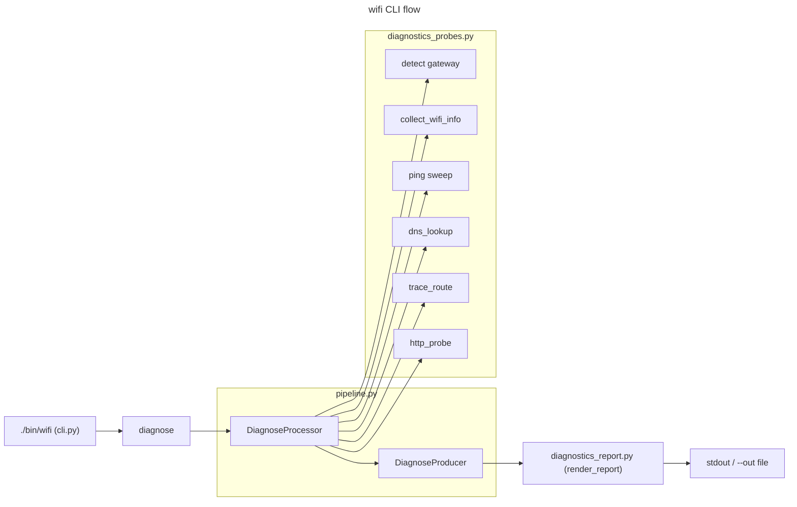

# Wi-Fi Assistant

Quick Wi-Fi/network diagnostics to separate Wi-Fi link issues from upstream ISP or DNS problems.

## Usage

```
./bin/wifi
./bin/wifi --ping-count 8 --json --out out/wifi.diag.json
./bin/wifi --no-trace --no-http
```

Legacy (still supported):
```
./bin/wifi-assistant
```

## Architecture



## Pipeline Pattern
- `DiagnoseProcessor`/`DiagnoseProducer` route through `SafeProcessor`/`BaseProducer` — see `core/pipeline.py`.
- `DiagnoseRequest.output_format: OutputFormat` (replaces removed `emit_json` field); `DiagnoseProducer` injects `OutputWriter`.
- `cmd_diagnose` returns `ExitCode` values; errors raise `CLIError`.

Probes:
- Stage 1: quick ICMP survey (few packets) to see what responds; skips ICMP-only conclusions when filtered.
- Detect default gateway (route/ip)
- Wi-Fi stats via `airport` (macOS), `nmcli`/`iwconfig` (Linux)
- Ping sweep: gateway + 1.1.1.1 + 8.8.8.8 + google.com
- DNS timing for a chosen host
- Optional traceroute/tracepath
- HTTPS smoke (TTFB + first bytes)
