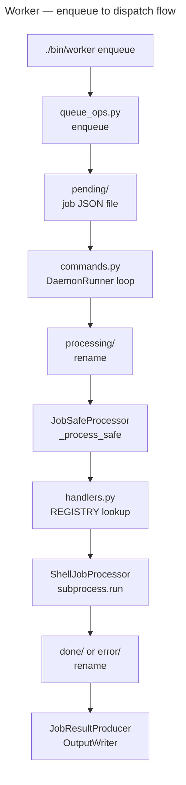

Worker

Overview
- Background job queue and daemon for deferred CLI tasks.
- Entry point: `./bin/worker`

Key Commands
- Enqueue a job: `./bin/worker enqueue --type <type>`
- Show job status: `./bin/worker status`
- Show a job: `./bin/worker show <job-id>`
- Retry a failed job: `./bin/worker retry <job-id>`
- Purge completed jobs: `./bin/worker purge`

Architecture

Jobs are file-based JSON under `QUEUE_ROOT`; atomicity is via write-to-temp + rename. The daemon polls `pending/`, moves to `processing/` on claim, then to `done/` or `error/` on completion.

Key Modules
- `cli.py` — CLIApp-based CLI dispatch; `main()` calls `app.run()`, which catches `CLIError`, `KeyboardInterrupt`, and other exceptions via `handle_error()`
- `commands.py` — command implementations: `ShowCommand`, `StatusCommand`, `RetryCommand`; `DaemonRunner` for the poll loop; `JobSafeProcessor`/`JobResultProducer` for job execution
- `handlers.py` — job type handlers; `ShellJobProcessor`/`ShellJobResult` for subprocess jobs
- `helpers.py` — `QueueRootIsolationMixin` for test queue isolation

Pipeline Pattern
- `JobSafeProcessor(SafeProcessor)` delegates to the `HANDLERS` registry in `_process_safe()`.
- `JobResultProducer(BaseProducer)` dispatches outcomes in `_produce_success()`.
- `ShellJobProcessor(SafeProcessor)` wraps `subprocess.run` calls.
- Output routes through `OutputWriter`; errors raise `CLIError` or `UsageError`.

Tests
- `tests/worker_tests/`
