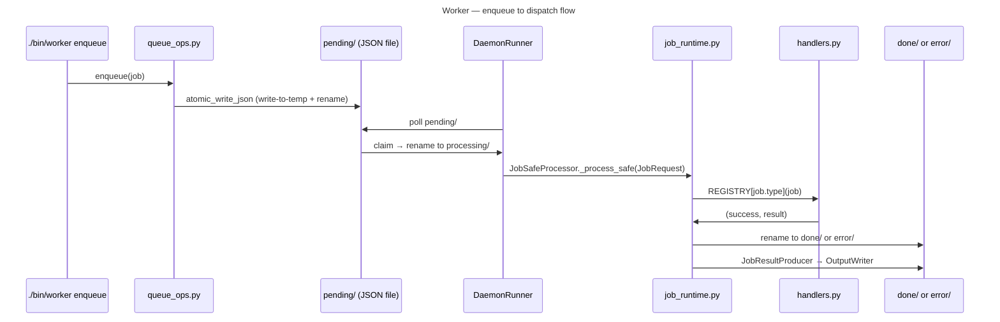

# Worker

Background job queue and daemon for deferred CLI tasks. Entry point: `./bin/worker`.

Does not support `--agentic`; discover subcommands with `./bin/worker --help`.

## Key Commands

```bash
./bin/worker enqueue --type run_cli --payload-json '{"cmd":["mail","labels","list"]}'
./bin/worker enqueue --type run_shell --payload-json '{"script":"..."}'
./bin/worker enqueue --type workflow_stage --payload-json '{...}'
./bin/worker daemon                  # run poll loop (default interval: 5s)
./bin/worker run-once                # process up to N pending jobs once
./bin/worker list                    # show queue counts
./bin/worker status                  # detailed queue and worker summary
./bin/worker show <job-id>           # show job JSON
./bin/worker retry <job-id>          # requeue a single error job
./bin/worker requeue-errors          # move all error/ jobs back to pending/
./bin/worker purge                   # delete old done/error jobs
```

Job types: `run_cli` (allowlisted `./bin/` command), `run_shell` (allowlisted shell script), `workflow_stage` (workflow engine stage).

## Architecture



Jobs are file-based JSON under `QUEUE_ROOT`. Atomicity is via write-to-temp + rename. The daemon polls `pending/`, moves to `processing/` on claim, then to `done/` or `error/` on completion. `--max-inflight` caps concurrent processing jobs.

## Key Modules

- `cli.py` — CLIApp-based dispatch; `main()` calls `app.run()`, which catches `CLIError`, `KeyboardInterrupt`, and other exceptions via `handle_error()`
- `commands.py` — `EnqueueCommand`, `ListCommand`, `StatusCommand`, `ShowCommand`, `RequeueErrorsCommand`, `RetryCommand`, `PurgeCommand`
- `job_runtime.py` — `JobSafeProcessor(SafeProcessor)`, `JobResultProducer(BaseProducer)`, `WorkerConfig`, `JobContext`, `JobRequest`, `JobResult`; `DaemonRunner` poll loop
- `handlers.py` — `handle_run_cli`, `handle_run_shell`, `handle_workflow_stage`; `ShellJobProcessor(SafeProcessor)` wraps subprocess; allowlist enforced in `_is_allowed_bin` / `_shell_allowlist`
- `queue_ops.py` — `enqueue`, queue file operations
- `queue.py` — queue directory layout and path resolution
- `queue_metrics.py` — throughput and performance metrics
- `_helpers.py` — `atomic_write_json`, `safe_load_json`, `get_worker_state_dir`, `log_perf_jsonl`

## Tests

`tests/worker_tests/`
