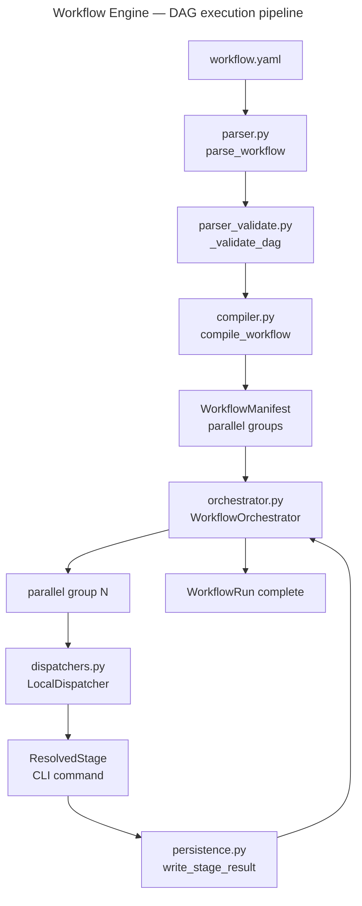

Workflow Engine

Overview
- YAML DAG workflow engine for composing and running multi-step assistant tasks.
- Entry point: `./bin/workflow`

Key Commands
- Run a workflow: `./bin/workflow run workflow.yaml`
- Parse/validate: `./bin/workflow lint workflow.yaml`
- List workflows: `./bin/workflow list`
- Show status: `./bin/workflow status out/my-workflow-run`

Architecture

`compiler.py` performs BFS topological sort to produce parallel groups; `orchestrator.py` walks groups and pauses on human gates.

Key Modules
- `cli.py` — command dispatch; `_emit_one`/`_emit_rows` delegate to `core.cli_output`
- `cli_dispatch.py` — argument resolution; errors raise `CLIError` (not `SystemExit`)
- `compiler.py` — DAG compilation; `WorkflowCompileError` subclasses `CLIError`
- `dispatchers.py` — `LocalDispatcher` runs workflow stages; SafeProcessor wrapping intentionally deferred (engine is the pipeline)

Pipeline Pattern
- The workflow engine itself is the orchestration layer; SafeProcessor wrapping would create a circular abstraction.
- Error boundary: `CLIError`/`handle_error()` at `main()` in `cli.py`.
- Verb convention: `run` (not `apply`), `lint` (not `verify`) — domain-specific deviations documented in `cli.py` module docstring.

Tests
- `tests/workflow_tests/`
