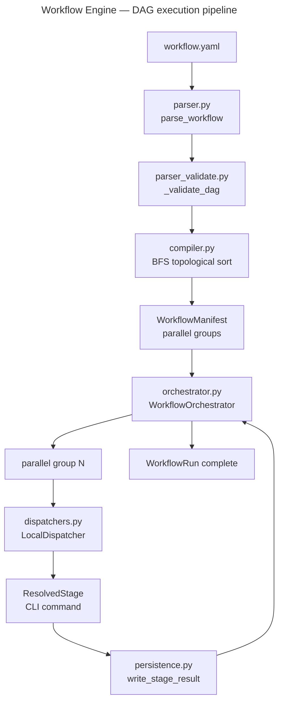

# Workflow Engine

YAML DAG engine for composing and running multi-step assistant tasks. Entry point: `./bin/workflow`.

Supports `--agentic`: `./bin/workflow --agentic --agentic-format yaml --agentic-compact`.

## Key Commands

```bash
./bin/workflow run workflow.yaml           # dry-run (preview only)
./bin/workflow run workflow.yaml --execute # execute for real
./bin/workflow lint workflow.yaml          # validate YAML structure
./bin/workflow parse workflow.yaml         # parse and display structure
./bin/workflow compile workflow.yaml       # show execution plan (parallel groups)
./bin/workflow list                        # list available workflow definitions
./bin/workflow status <workspace-dir>      # show status of a completed run
./bin/workflow init-workspace workflow.yaml  # create workspace + manifest
./bin/workflow resume <workspace-dir>      # show which stages need re-running
./bin/workflow validate-fragment frag.yaml # validate a workflow fragment
./bin/workflow check-params "<ws>/manifest.json" --check 'name=regex'  # guard a param
./bin/workflow parse-overview "<ws>/outputs/threads.json" --pr N --out "<ws>/outputs/review-overview.json"
./bin/workflow check-paths <path> [<path> ...]                          # refuse escaping/protected paths
./bin/workflow check-fix-index "<ws>/outputs/fix-index.json"            # id / file_id gate
./bin/workflow thread-fingerprints "<ws>/outputs/threads.json"          # per-thread discriminators
./bin/workflow check-thread-ids "<ws>/outputs/threads.json" "<ws>/outputs/triage.json" [--repair]
./bin/workflow aggregate-fix-results "<ws>/outputs/fix-index.json" "<ws>/outputs/fixes" "<ws>/outputs/fix-results.json"
./bin/workflow snapshot-dirty "<ws>/outputs/dirty-baseline.json"        # record dirty paths before fixers run
./bin/workflow check-unlisted "<ws>/outputs/dirty-baseline.json" "<ws>/outputs/fix-results.json"
./bin/workflow select-concerns --paths-file <file|-> [--task-type T] --format json  # concern guides for paths
./bin/workflow review-rounds --prs N[,N...] --out-dir <dir>             # bot review-round data per PR
./bin/workflow count-sweep --pattern <regex> --path <path> [--path ...] # count matching lines, no shell
```

Stage guards. Each one reads untrusted values as JSON data from a workspace
file (never from argv). Exit 0 means pass, 1 means fail. Errors go to stderr
and name an entry, never its rejected value.

- `check-params` validates params against `--check name=regex` (full match,
  repeatable). It reads the manifest's `trigger_params`, or the document root
  with `--top-level`, for stage outputs such as `handler.json`. `--print name`
  writes that one value to stdout only if every check passed, and only for a
  name some `--check` covers. It lets a stage write `X=$(...)` instead of
  interpolating a raw param.
- `check-fix-index` checks that every fix-index entry has a unique string
  `id` and a unique `file_id` matching `[A-Za-z0-9][A-Za-z0-9._-]{0,199}`.
- `check-paths` exits 1 and prints `REFUSED <reason>: <path>` for any path that
  escapes the repo or is protected (`.git`, `.github/`, `.claude/`, `.envrc`).
- `parse-overview` parses Copilot overview review bodies from a threads.json
  into linked and unlinked findings, each with an `id` and a `file_id`. See
  `core/copilot_overview.py`.
- `thread-fingerprints` prints JSON `[{index, thread_id, database_id,
  body_fingerprint}]` for a threads.json. It is the one tested body hash.
- `check-thread-ids` is the review-fix-threads id-coherence gate. It skips null
  ids. Each other id must exist in the fetch and match the discriminator triage
  recorded (`database_id`, or `fingerprint` as a fallback), so swapped ids
  halt. A coordinate-only difference halts unless `--repair` is given, which
  rewrites triage.json and records `_id_repairs`. See `review_ids.py`.
- `aggregate-fix-results` merges `fixes/<file_id>.json` into fix-results.json
  on `id`, never `thread_id`. A file counts only if its name is an expected
  `file_id` and its in-file `id` and `thread_id` equal that entry's; otherwise
  it is a `key_mismatch` and its finding is reported missing.
- `snapshot-dirty` records the checkout's dirty and untracked paths with
  content hashes, plus HEAD, before any fixer runs.
- `check-unlisted` exits 1 if a path changed since that snapshot is missing
  from fix-results.json `files_changed`. It also needs a `pr-context.json`
  beside the baseline holding `dirty_baseline_sha256`, the baseline's sha256
  recorded right after `snapshot-dirty` wrote it; the baseline is re-hashed
  against it. It fails closed: a missing or mismatched `pr-context.json`, an
  unreadable input, or a failed git call is exit 1, never a pass.

Other commands. For every command, argparse rejects a missing required flag or
a malformed value (e.g. a non-integer `--recent`) with exit 2 before the
handler runs; the exit codes below are the handlers' own.

- `select-concerns` prints the `concerns/*.md` guides that apply to a set of
  paths, using the canonical rules in `concerns/selection.yaml`. Pass paths
  with `--paths-file <file>` or `--paths-file -` (stdin), never inline, and set
  `pipefail` when piping `git diff` into it. `--format json` gives
  `{"guides": [...], "matched": {guide: [reasons]}}`. Exit 0 on success; 1 on
  an I/O or parse error, including a missing `selection.yaml` outside a
  checkout; 2 on an unknown `--task-type` (the valid types come from
  `selection.yaml`). See `concern_select.py`.
- `review-rounds` fetches bot review-round data for `--prs` or the `--recent N`
  PRs and writes `pr<N>.json` plus `summary.json` to `--out-dir`. Exit 1 when
  the handler rejects the arguments (e.g. both or neither of `--prs` and
  `--recent`), on an API failure, or on truncated pagination.
- `count-sweep` counts lines matching a Python regex under each `--path` and
  prints `{hits, files}`. Paths resolve against `--root`, which defaults to the
  repo root and may be a directory inside it, so `--root src --path
  workflow/x.py` reads `src/workflow/x.py`. The command itself runs no shell, but
  your shell still parses the command line, so single-quote the regex as one
  argument (`--pattern 'foo|bar'`). Exit
  2 on an invalid pattern, a refused or missing path, or a `--root` outside
  the checkout; 1 when the scan hit its work bound, so the count is partial.

`run` defaults to dry-run; pass `--execute` to execute. `--params key=value` overrides trigger parameters (repeatable).

Constrain overridable params with `trigger.param_rules` (name → full-match regex)
and `trigger.required` (names that must be non-blank). The engine enforces both in
`compile_workflow`, before any `{param}` is substituted, so `compile`, `run`, and
`init-workspace` all exit 1 on a violation. A blank optional param is exempt from
its rule. Errors name the param, never the value. Fragments may declare rules too,
and every rule that applies to a param must pass. See `param_rules.py`.

## Architecture


```mermaid
---
title: Workflow Engine — DAG execution pipeline
---
flowchart TB
    YAML[workflow.yaml] --> parse[parser.py\nparse_workflow]
    parse --> validate[parser_validate.py\n_validate_dag]
    validate --> compile[compiler.py\nBFS topological sort]
    compile --> manifest[WorkflowManifest\nparallel groups]
    manifest --> orchestrator[orchestrator.py\nWorkflowOrchestrator]
    orchestrator --> group[parallel group N]
    group --> dispatcher[dispatchers.py\nLocalDispatcher]
    dispatcher --> stage[ResolvedStage\nCLI command]
    stage --> persist[persistence.py\nwrite_stage_result]
    persist --> orchestrator
    orchestrator --> done[WorkflowRun complete]
```

`compiler.py` performs BFS topological sort to produce parallel groups. Stages with `human_gate: true` are isolated into their own group; the orchestrator pauses after that group and waits for acknowledgement before continuing.

## Stage Kinds

| Kind | Description |
|---|---|
| `gather` | collect / search inputs |
| `propose` | draft or plan |
| `execute` | run a command or script |
| `validate` | check or review output |
| `publish` | write or emit results |
| `sub-workflow` | inline sub-workflow (orchestrator invokes `/workflow` skill directly) |

Set `human_gate: true` on any stage to pause execution for human review after that stage completes.

## Key Modules

- `cli.py` — CLIApp-based dispatch; `_emit_one`/`_emit_rows` delegate to `core.cli_output`
- `cli_dispatch.py` — argument resolution; errors raise `CLIError` (not `SystemExit`)
- `cli_compile.py` — `_cmd_compile` implementation
- `compiler.py` — BFS topological sort; `WorkflowCompileError` subclasses `CLIError`; splits human-gated stages into isolated groups
- `parser.py` / `parser_fields.py` / `parser_errors.py` — YAML parsing and field validation
- `parser_validate.py` — DAG cycle detection and structural validation
- `orchestrator.py` — `WorkflowOrchestrator`: walks parallel groups, pauses on human gates, handles `when` conditions
- `dispatchers.py` — `LocalDispatcher` runs stages; SafeProcessor wrapping deferred (engine is the pipeline)
- `persistence.py` — `write_stage_result`; workspace file layout
- `include.py` — workflow fragment inclusion and merging
- `models.py` — `StageKind`, `ResolvedStage`, `WorkflowManifest`, `WorkflowRun` dataclasses
- `linter.py` — structural lint checks
- `dag.py` — `bfs_levels`: level-by-level topological walk shared by the compiler and linter
- `linter_shell.py` / `shell_text.py` — warnings (with `rule` ids) on shell embedded in stage prose: `shell-unvalidated-param`, `shell-unquoted-fan-out-key`, `shell-unbound-variable`, `python-not-isolated`, `validate-stage-writes-output`, `shell-guard-refused`
- `output_checks.py` — post-stage output validation
- `param_guard.py` — `check-params`: validate params read as JSON data
- `review_ids.py` — `check-fix-index`, `thread-fingerprints`, `check-thread-ids`, `aggregate-fix-results`

## Tests

`tests/workflow_tests/`
